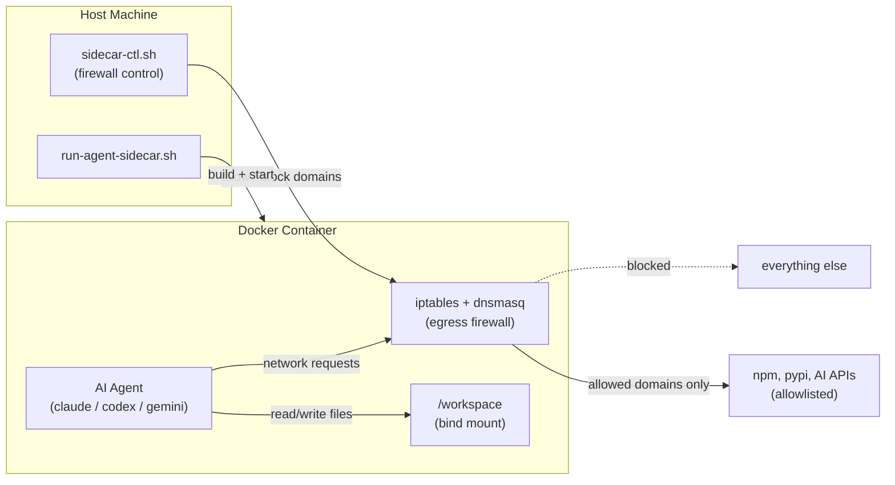

# AI Tools

Claude Code plugins and sandboxed Docker environments for AI coding assistants.

## Claude Code Plugins

Install via the Claude Code marketplace:

```bash
/plugin marketplace add ShravanSunder/ai-tools
```

Then install individual plugins with `/plugin install <name>@ai-tools`.

| Plugin | Description |
|--------|-------------|
| [`ai-scaffold`](plugins/ai-scaffold/) | Project scaffolding with standard dev configs (biome, ruff, vitest, pytest, cursor rules, claude hooks) |
| [`skill-peekaboo`](plugins/skill-peekaboo/) | Visual UI testing for macOS apps using Peekaboo CLI |
| [`quorum-counsel`](plugins/quorum-counsel/) | Multi-model review orchestration -- counsel-reviewer and codex-solver background agents |

See [`plugins/`](plugins/) for full details.

---

## Agent Sidecar

Run AI coding agents (Claude Code, Codex, Gemini CLI) inside Docker containers with network-level isolation. The agent gets full workspace access but can only reach domains you explicitly allow.

```bash
# From any git repository
run-agent-sidecar.sh --run-claude
```

### Why a sidecar container?

AI agents with tool use can execute arbitrary shell commands, install packages, and make network requests. Running them in a container with an egress firewall provides a practical security boundary without giving up functionality:



| Concern | How it's handled |
|---------|-----------------|
| **Arbitrary network access** | Egress firewall blocks all traffic except allowlisted domains (npm, pypi, AI APIs). Toggle presets for GitHub push, Notion, Linear. |
| **Persistent state leaking** | Named volumes isolate shell history, venvs, node_modules per workspace. Container recreation is cheap (`--reload` ~5s). |
| **Package supply chain** | APT repos blocked at firewall level after build. Runtime installs impossible. |
| **Git corruption** | `.git/` mounted read-only. Agent can read history but cannot rewrite refs or force-push. |
| **Config tampering** | `.agent_sidecar/` shadowed with empty tmpfs. Agent cannot read or modify sidecar configuration. |
| **Scope creep across repos** | Each repo gets its own container, volumes, and firewall rules. No cross-repo contamination. |

### Configuration at a glance

Three-tier config hierarchy lets you customize per-team and per-developer without forking:

```
Base (agent_sidecar/setup/)     -- defaults shipped with this repo
  + Repo (.agent_sidecar/*.repo.*)  -- team overrides, committed
    + Local (.agent_sidecar/*.local.*) -- personal overrides, gitignored
```

Additive files (firewall allowlists, zshrc, init scripts) merge all tiers. Override files (config, dockerfile) pick the highest-priority tier.

### Quick reference

```bash
run-agent-sidecar.sh --run-claude    # Start Claude Code in sidecar
run-agent-sidecar.sh --run-codex     # Start Codex
run-agent-sidecar.sh --run-gemini    # Start Gemini CLI
run-agent-sidecar.sh --reload        # Recreate container (~5s)
run-agent-sidecar.sh --full-reset    # Rebuild image + recreate (~2-5min)

sidecar-ctl firewall allow notion    # Allow Notion API
sidecar-ctl firewall toggle 15m      # Enable all presets for 15 minutes
sidecar-ctl firewall clear           # Revoke all toggle access
sidecar-ctl status                   # Show container + firewall state
```

See [`agent_sidecar/`](agent_sidecar/) for full setup, architecture, and configuration docs.

---

## Repository Structure

```
ai-tools/
├── plugins/                     # Claude Code plugins
│   ├── ai-scaffold/             # Project scaffolding
│   ├── skill-peekaboo/          # macOS visual UI testing
│   └── quorum-counsel/          # Multi-model review orchestration
├── skills/                      # Pure skills (future)
├── agent_sidecar/               # Docker sidecar system
└── CLAUDE.md                    # Agent instructions
```
