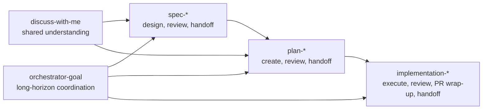

# AI Tools

Local Codex and Claude Code plugins for AI-assisted development workflows. This
repo also includes Agent Sidecar, a Docker-based sandbox for running coding
agents with network isolation.

## Core Plugins

Install through the local ai-tools marketplaces.

```bash
codex plugin marketplace add ~/dev/ai-tools
/plugin marketplace add ShravanSunder/ai-tools
```

Then install individual plugins with `codex plugin add <name>@ai-tools` in Codex or `/plugin install <name>@ai-tools` in Claude Code.

| Plugin | Description |
|--------|-------------|
| [`shravan-dev-workflow`](plugins/shravan-dev-workflow/) | Codex-first spec, plan, implementation, PR wrap-up, review, handoff, debugging, TUI presentation, and ops Linear tracking workflows |
| [`ai-scaffold`](plugins/ai-scaffold/) | Project scaffolding with standard dev configs (biome, ruff, vitest, pytest, cursor rules, claude hooks) |
| [`skill-peekaboo`](plugins/skill-peekaboo/) | Visual UI testing for macOS apps using Peekaboo CLI |

See [`plugins/`](plugins/) for full details.

Release notes live in [`docs/changelog/`](docs/changelog/).

### Shravan Dev Workflow

The main workflow plugin is organized by namespace and phase boundary:


```mermaid
flowchart LR
    discuss["discuss-with-me<br/>shared understanding"]
    goal["orchestrator-goal<br/>long-horizon coordination"]

    spec["spec-*<br/>design, review, handoff"]
    plan["plan-*<br/>create, review, handoff"]
    impl["implementation-*<br/>execute, review, PR wrap-up, handoff"]

    discuss --> spec
    discuss --> plan
    goal --> spec
    goal --> plan
    goal --> impl
    spec --> plan
    plan --> impl
```

Operations skills such as `ops-security-review` and `ops-linear-tracking` sit
outside the main phase path.

### Shared Observability

`observability/` owns the shared local OpenTelemetry collector plus
VictoriaMetrics, VictoriaLogs, and VictoriaTraces stack. Use
`shravan-dev-workflow:ops-observability-stack` for producer boundaries,
AgentStudio and Agent VM loops, resource naming, and Victoria query recipes.

Start with [`plugins/shravan-dev-workflow/README.md`](plugins/shravan-dev-workflow/)
for the full workflow map, phase diagrams, and skill boundaries.

### Manual Counsel

[`quorum-counsel`](plugins/quorum-counsel/) remains available for manual
multi-model counsel, but it is not the default review path. Prefer
`shravan-dev-workflow` review swarms for day-to-day implementation, plan, and
spec review.

---

## Agent Sidecar

Agent Sidecar runs coding agents inside a Docker container with a deny-by-default
egress firewall. Use it when an agent needs to execute commands with tighter
network and workspace boundaries than a normal host session.

```bash
# From any git repository
run-agent-sidecar.sh --run-claude    # Start Claude Code in sidecar
run-agent-sidecar.sh --run-codex     # Start Codex
run-agent-sidecar.sh --run-gemini    # Start Gemini CLI
run-agent-sidecar.sh --reload        # Recreate container (~5s)
run-agent-sidecar.sh --full-reset    # Rebuild image + recreate (~2-5min)

sidecar-ctl firewall allow notion    # Allow Notion API
sidecar-ctl firewall toggle 15m      # Enable all presets for 15 minutes
sidecar-ctl firewall clear           # Revoke all toggle access
sidecar-ctl status                   # Show container + firewall state
```

See [`agent_sidecar/README.md`](agent_sidecar/README.md) for setup,
architecture, configuration, firewall presets, lifecycle, and debugging docs.
Use [`agent_sidecar/INSTRUCTIONS.md`](agent_sidecar/INSTRUCTIONS.md) as the
concise file copied into repos that initialize sidecar support.

---

## Repository Structure

```
ai-tools/
├── plugins/                     # Codex and Claude Code plugins
│   ├── shravan-dev-workflow/    # Spec, plan, implementation, review, handoff workflows
│   ├── ai-scaffold/             # Project scaffolding
│   ├── skill-peekaboo/          # macOS visual UI testing
│   └── quorum-counsel/          # Optional manual multi-model counsel
├── agent_sidecar/               # Docker sidecar system
├── observability/               # Shared local OTel/Victoria stack
├── agents.md                    # Maintainer and agent instructions
└── CLAUDE.md                    # Claude Code alias for agents.md
```
