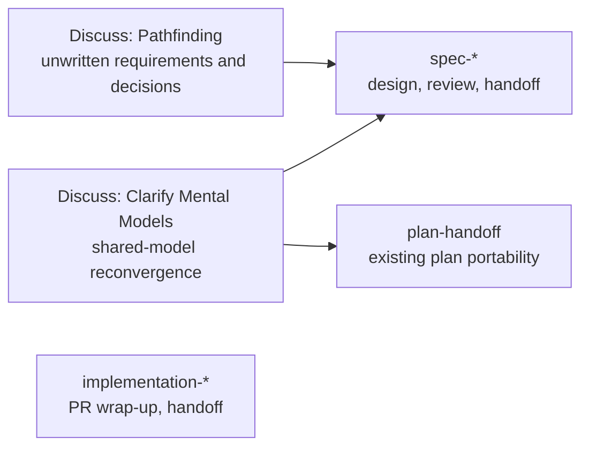

# AI Tools

Local Codex and Claude Code plugins for AI-assisted development workflows.

## Core Plugins

Install through the local ai-tools marketplaces.

```bash
codex plugin marketplace add ~/dev/ai-tools
/plugin marketplace add ShravanSunder/ai-tools
```

The plugin IDs below are shared across Codex and Claude Code.

| Client | Scaffolding | Dev workflow | Dev tools |
|--------|-------------|--------------|-----------|
| Codex | `scaffold-project@ai-tools` | `shravan-dev-workflow@ai-tools` | `dev-workflow-tools@ai-tools` |
| Claude Code | `scaffold-project@ai-tools` | `shravan-dev-workflow@ai-tools` | `dev-workflow-tools@ai-tools` |

```bash
codex plugin add <name>@ai-tools
/plugin install <name>@ai-tools
```

| Plugin | Description |
|--------|-------------|
| [`shravan-dev-workflow`](plugins/shravan-dev-workflow/) | Codex-first spec, program design, pathfinding, plan, implementation, PR wrap-up, review, handoff, debugging, TUI presentation, and ops workflows |
| [`dev-workflow-tools`](plugins/dev-workflow-tools/) | Common development tool skills, including native macOS UI testing with Peekaboo CLI |
| [`scaffold-project`](plugins/ai-scaffold/) | AI Scaffold project scaffolding with standard dev configs (biome, ruff, vitest, pytest, cursor rules, claude hooks) |
| [`agent-router`](plugins/agent-router/) | Agent collaboration, shared message boards, wake-ups, and schedules; install as `agent-router@ai-tools` (Cursor Personal marketplace too) |

See [`plugins/`](plugins/) for full details.

Release notes live in [`docs/changelog/`](docs/changelog/).

### Shravan Dev Workflow

The main workflow plugin is organized by namespace and phase boundary:


```mermaid
flowchart LR
    pathfinding["Discuss: Pathfinding<br/>unwritten requirements and decisions"]
    clarify["Discuss: Clarify Mental Models<br/>shared-model reconvergence"]
    spec["spec-*<br/>design, review, handoff"]
    plan["plan-handoff<br/>existing plan portability"]
    impl["implementation-*<br/>PR wrap-up, handoff"]

    pathfinding --> spec
    clarify --> spec
    clarify --> plan
```

Operations skills such as `ops-security-review` and `ops-linear-tracking` sit
outside the main phase path.

### Shared Observability

`observability/` owns the shared local OpenTelemetry collector plus the
VictoriaMetrics, VictoriaLogs, and VictoriaTraces stack. Use
`shravan-dev-workflow:ops-observability-stack` for producer boundaries,
AgentStudio and Agent VM loops, resource naming, and Victoria query recipes.

Start with [`plugins/shravan-dev-workflow/README.md`](plugins/shravan-dev-workflow/)
for the full workflow map, phase diagrams, and skill boundaries.

---

## Agent Sidecar

Sandboxed Docker environments for coding agents. Docs live in [`agent_sidecar/`](agent_sidecar/).

---

## Repository Structure

```
ai-tools/
├── plugins/                     # Codex and Claude Code plugins
│   ├── shravan-dev-workflow/    # Spec, plan, implementation, review, handoff workflows
│   ├── dev-workflow-tools/      # Common tool skills, including Peekaboo UI testing
│   └── ai-scaffold/             # Project scaffolding
├── agent_sidecar/               # Docker sidecar system
├── observability/               # Shared local OTel/Victoria stack
├── AGENTS.md                    # Maintainer and agent instructions
└── CLAUDE.md                    # Claude Code alias for AGENTS.md
```

- [Agent Router plugin](plugins/agent-router/) — agent collaboration, shared message boards, wake-ups and schedules; canonical skill maintained in Router.
