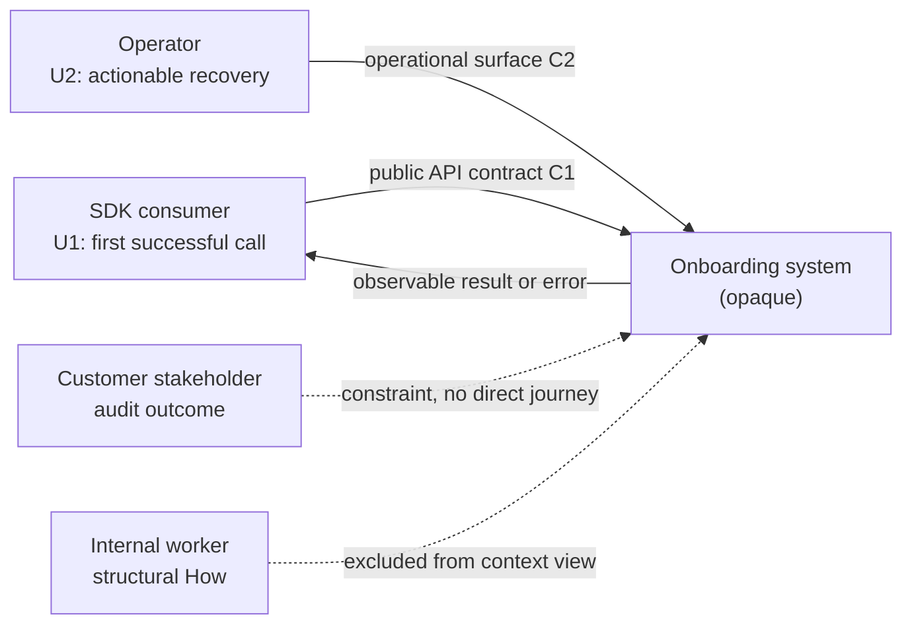

# User-Requirements and Design-View Manual Proof

Date: 2026-07-31
Scope: manual preview of one Mermaid fenced source, one Markdown table, and one fenced plain-text fallback
Boundary: no Mermaid renderer is installed in this checkout; Mermaid source text was inspected, but rendered Mermaid output was not inspected. Per `shared-references/diagram-rendering-and-fallbacks.md`, rendered-readability for Mermaid is an explicit gap. The Markdown table and plain-text fallback remain valid text-inspectable previews.

## Mermaid Context View



Source-text check (not a rendered visual check):

- external consumers/stakeholder and observable surfaces are named in the fenced source;
- the system remains one opaque node in the source;
- the internal worker is named as excluded negative space rather than drawn inside the system;
- U1/U2 and C1/C2 anchors survive in the source;
- result: gap — Mermaid source was inspected, but rendered Mermaid readability was not performed (shared rendering rule requires inspecting rendered output; mark as explicit gap, not pass).

## Markdown Requirement Coverage Table

| U root | Problem | Outcome | Requirement | Contract | Proof obligation | Gap |
| --- | --- | --- | --- | --- | --- | --- |
| U1 SDK consumer | P1 setup failure is opaque | O1 first call succeeds or fails actionably | R1 return actionable authentication failure | C1 public API error shape | V1 integration behavior | none |
| U2 operator | P2 recovery owner is unclear | O2 operator can recover without source inspection | R2 expose recovery state | C2 operational status surface | V2 manual operational proof | evidence source pending |

Visual check:

- the dense U→P→O→R→C→V relationship is easier to scan as a table than topology;
- the missing evidence remains visible instead of being silently filled;
- result: pass.

## Fenced Plain-Text Call Fallback

```text
SDK consumer
  -> public API [owner: API boundary; input authority: request]
      -> async worker [owner: onboarding coordinator; edge: queued event]
          -> provider [side effect: credential verification]
          <- accepted | timeout error
      <- completion event | retryable failure
  <- actionable result | actionable error

evidence anchors: API handler, queue consumer, provider adapter, integration trace
```

Visual check:

- entrypoint, owners, async boundary, side effect, result/error path, and evidence anchors are visible;
- the view remains readable without Mermaid support;
- result: pass.

## Proof Boundary

The table and plain-text previews preserve their representative required fields. The Mermaid source retains its fields, but rendered readability remains unverified and therefore cannot pass the visual check. These previews do not prove stochastic skill invocation or behavior under pressure. Model pressure execution is deferred by explicit user direction.
