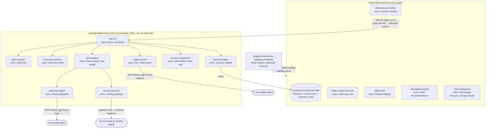
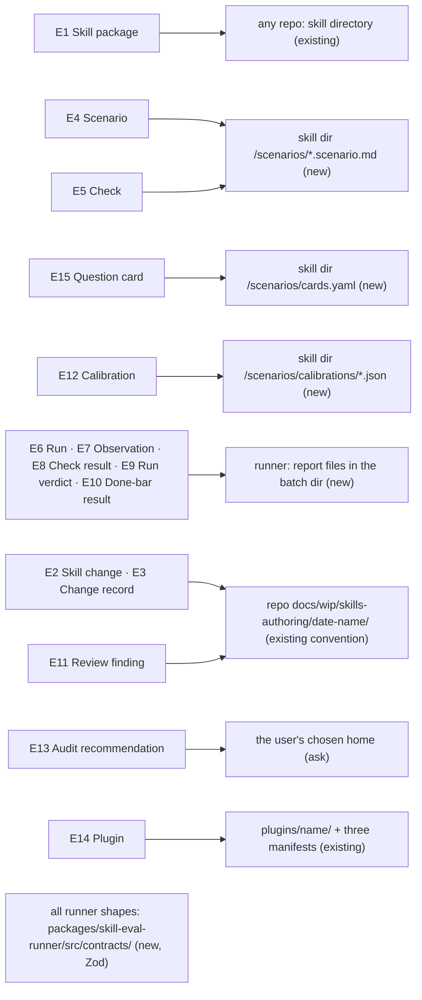
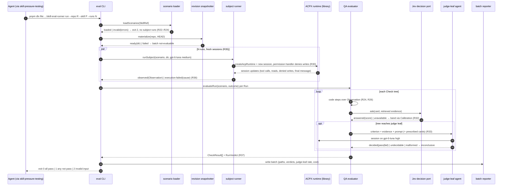
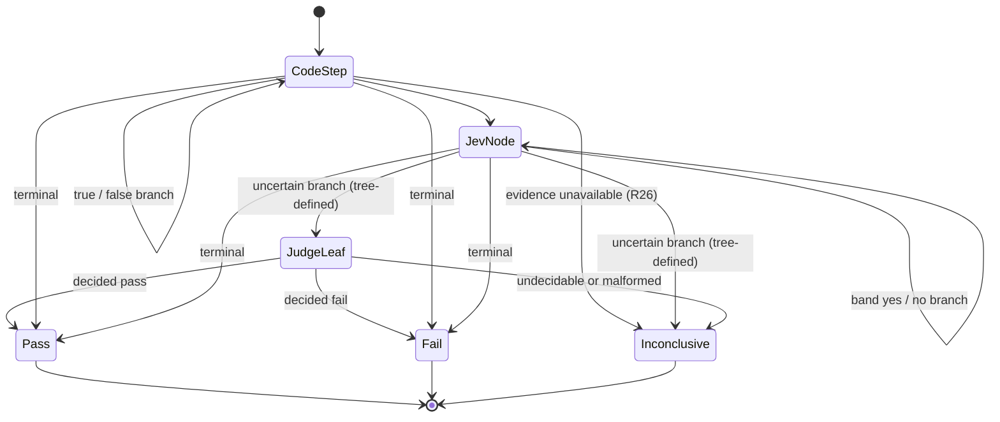

# Skill authoring plugin: Program Design

How the system satisfies the [Specification](2026-10-02-skill-authoring-plugin.md) (`E1`–`E15`, `R1`–`R50`), which traces to the [Requirements](user-requirements.md) (`U1`–`U35`). Entity terms follow the Specification; code names appear only in the shape and home cells.

## The system at a glance

Two new homes replace one old one:

- the `skill-authoring` **plugin**: skills plus their scenarios;
- the `skill-eval-runner` **package**: everything that runs and grades scenarios.

`shravan-dev-workflow` loses two skills and keeps no link to either new home.



**What changes and what stays.**
- Grading moves from regexes and a single all-criteria judge to one decision tree per Check. The tree runs code steps first, then Jev questions, and reaches a Luna-high judge only at a leaf the tree names.
- The subject still runs through ACPX. The runner now calls ACPX as a library (`acpx/runtime`) inside its own Deno process instead of spawning the `acpx` command.
- The old `tests/skills` runner and its legacy scenario form are deleted (hard cutover, `R45`).

## Choices that shaped the structure

| Crux | Chosen | Rejected, and why | Reopen if |
|---|---|---|---|
| Where grading logic lives | in data: each Check's decision tree and Question cards are declared beside the Scenario; the runner only executes trees | per-scenario TypeScript evaluators. Every scenario would become code, and a skill author could not read or reuse the checks | trees need loops or arithmetic that the code-step catalog cannot express |
| How the subject sees the skill at a revision | the runner extracts the repository at that revision into a temporary read-only snapshot and runs the subject there | an installed plugin cache. It can't pin a revision, and the before and after runs a fix needs (`R39`) would be impossible | a skill needs the host's installed plugin to load correctly |
| How Deno starts under `pnpm dlx` | the package `bin` is a three-line Node shim that runs Deno from the package's own `deno` npm dependency | a `#!/usr/bin/env deno` shebang. Deno would need a global install, which `R50` forbids | `pnpm dlx` gains a runtime selector |
| Jev before its tool exists | a `JevDecisionPort` interface with a no-engine adapter that always answers `unavailable`, which falls in the uncertain band (`R32`) | the runner calling OpenRouter Jev directly. That builds the Jev tool here, against the owner's assignment | the Jev tool ships; it plugs into the port with no change to trees or cards |
| Where results go | `<cache>/skill-evals/<repo-slug>/<batch-id>/` outside the repository, or `--out` | the repository's `tmp/`. That dirties repositories that don't ignore `tmp/`, and `R50` keeps the runner out of the repo under test | owners want results committed beside scenarios |

**Debt we accept:**
- **Early runs are judge-heavy.** Until Calibrations exist, every Jev node falls in the uncertain band, so trees reach their judge leaf more often. *Payer:* run cost. *Closed when:* Calibrations are recorded per card and engine.
- **The Deno shim is one extra hop.** *Payer:* the startup time of each batch. *Closed when:* `pnpm dlx` can select a runtime.

## Where each entity lives



**Conventions found:**
- **Root `CLAUDE.md` / `AGENTS.md`** sets TypeScript rules: no `any`, explicit types, discriminated unions, `readonly`, and Zod derivation (`z.infer`).
- **The current runner** (`tests/skills/lib/.../scenario-case-types.ts:5`) uses plain interfaces and ajv JSON Schema.
- **The new package follows the root rule:** Zod schemas own runtime types, and each schema's JSON Schema export (`z.toJSONSchema`) is the interchange shape. The cards and trees it shares with the orchestration Inspector use the field names that lane fixed (`id, serves, evidence, type, question, combine, calibration`).

| E | Semantic owner | Package or module home | Schema/type home | Shape at each boundary | Disposition | Convention |
|---|---|---|---|---|---|---|
| E1 Skill package | the repository that holds it | any repo; `plugins/skill-authoring/skills/<skill>/` for the plugin's own (new) | none: identified by `{repoRoot, skillPath}` | `SkillRef {repoRoot: string, skillPath: string}` on CLI input | persisted (git) | Zod |
| E2 Skill change | skill-orchestrator (skill) | `plugins/skill-authoring/skills/skill-orchestrator` (new) | the Change record format in that skill's reference | `kind: "new-from-intent" \| "fix-for-recorded-failure"` passed to the done-bar CLI | persisted (doc) | Markdown section, documented in the skill |
| E3 Change record | skill-orchestrator | repo `docs/wip/skills-authoring/<date-name>/change-record.md` | `skill-orchestrator/references/change-record.md` (new) | item rows `{item, state: proposed\|implemented\|reviewed\|shipped, anchor}` | persisted | Markdown table |
| E4 Scenario | scenario loader | `<skill dir>/scenarios/<scenario-id>.scenario.md` (new) | `runner/src/contracts/scenario.ts` (new) | `ScenarioFile`: YAML front matter `{scenarioId, skill, status: draft\|active\|retired, allowWrites: boolean}`, `## Prompt` body, `checks` block | persisted | Zod |
| E5 Check | scenario loader (validity); QA evaluator (execution) | inside the Scenario file (new) | `runner/src/contracts/check-tree.ts` (new) | `CheckTree {checkId, criterion, root: NodeId, nodes: Record<NodeId, TreeNode>}` | persisted | Zod discriminated union on `TreeNode.kind` |
| E15 Question card | scenario loader | `<skill dir>/scenarios/cards.yaml` (new) | `runner/src/contracts/question-card.ts` (new) | `QuestionCard {id, serves, evidence: EvidenceQuery, type: "yes_no" \| "choice", question, options?}` | persisted | Zod, field names shared with the Inspector card |
| E12 Calibration | QA evaluator (reads); calibration is authored offline | `<skill dir>/scenarios/calibrations/<card-id>.<engine>.json` (new) | `runner/src/contracts/calibration.ts` (new) | `Calibration {cardId, engine, labelledSet, measuredAt, bands: {yes: [lo,hi], no: [lo,hi]} \| {high, mid, low}}` | persisted | Zod |
| E6 Run | subject runner | runner process memory; recorded in the batch dir | `runner/src/contracts/run.ts` (new) | `RunOutcome` (below) | persisted (report) | Zod |
| E7 Observation | subject runner | batch dir `runs/<run-id>/observation.json` | `runner/src/contracts/observation.ts` (new) | `Observation {runId, toolCalls[], filesRead[], writesAttempted[], writesDenied[], finalMessage, turns[]}` | persisted | Zod |
| E8 Check result | QA evaluator | batch dir `runs/<run-id>/checks.json` | `runner/src/contracts/check-result.ts` (new) | `CheckResult` (below) | persisted | Zod |
| E9 Run verdict | QA evaluator | batch dir `runs/<run-id>/verdict.json` | `runner/src/contracts/run-verdict.ts` (new) | `RunVerdict` (below) | persisted | Zod |
| E10 Done-bar result | done-bar assessor | batch dir `done-bar.json` | `runner/src/contracts/done-bar.ts` (new) | `DoneBarResult` (below) | persisted | Zod |
| E11 Review finding | skill-review (skill) | the Change record's review section | `skill-review/references/finding.md` (new) | `{anchor, property: teaching\|trigger\|rule-agreement\|placement\|claim-strength, state: candidate\|verified-at-anchor\|accepted\|rejected, evidence}` | persisted (doc) | Markdown table |
| E13 Audit recommendation | skill-audit (skill) | the user's chosen home (`R10`); default proposal: the user's skill backlog | `skill-audit/references/recommendation.md` (modified) | `{action: update\|create\|merge\|skip, fixOwner: prose\|code-check\|tool, signals[], recurrence}` | persisted (doc) | Markdown table |
| E14 Plugin | repository maintainers | `plugins/skill-authoring/` (new); `plugins/shravan-dev-workflow/` (modified) | the three manifest schemas (existing) | `.claude-plugin/plugin.json`, `.codex-plugin/plugin.json`, `.cursor-plugin/plugin.json`; three marketplace entries | persisted | existing manifest form |

`packages/skill-eval-runner` is abbreviated `runner/` in the table.

### Contract shapes the runner exposes

```ts
// runner/src/contracts/check-tree.ts
export const treeNodeSchema = z.discriminatedUnion("kind", [
  z.object({ kind: z.literal("code"), step: codeStepSchema,           // from the code-step catalog below
             onTrue: nodeRef, onFalse: nodeRef, onUnavailable: nodeRef }),
  z.object({ kind: z.literal("jev"), cardId: z.string(),
             branches: z.object({ yes: nodeRef, uncertain: nodeRef, no: nodeRef }) }),     // yes_no card
  z.object({ kind: z.literal("jev-choice"), cardId: z.string(),
             branches: z.record(z.string(), nodeRef), uncertain: nodeRef }),               // choice card
  z.object({ kind: z.literal("judge"), criterion: z.string(), tools: z.array(z.string()).default([]),
             toolsReason: z.enum(["code-execution", "composition"]).optional() }),
  z.object({ kind: z.literal("terminal"), result: z.enum(["pass", "fail", "inconclusive"]), reason: z.string() }),
]);

// runner/src/contracts/run.ts
export type RunOutcome =
  | { readonly kind: "observed"; readonly runId: string; readonly observation: Observation }
  | { readonly kind: "execution-failed"; readonly runId: string;
      readonly cause: "permission-stop" | "agent-start-failed" | "acpx-error" | "timeout" | "cancelled" };

// runner/src/contracts/check-result.ts
export type CheckResult = {
  readonly checkId: string;
  readonly result: "pass" | "fail" | "inconclusive";
  readonly decidedBy: "code" | "jev" | "judge" | "terminal";
  readonly path: readonly { nodeId: string; band?: "yes" | "uncertain" | "no" | string; evidenceRef: string }[];
};

// runner/src/contracts/run-verdict.ts
export type RunVerdict = "execution-failed" | "inconclusive" | "fail" | "pass";

// runner/src/contracts/done-bar.ts
export type DoneBarResult =
  | { readonly kind: "met"; readonly bar: "new-from-intent" | "fix-for-recorded-failure"; readonly runs: readonly string[] }
  | { readonly kind: "not-met"; readonly reason: "check-failed" | "run-failed" | "failure-not-reproduced" | "fewer-than-3-passes" }
  | { readonly kind: "not-evaluable"; readonly reason: "execution-failed-run" | "inconclusive-run" | "no-active-scenario" };

// runner/src/judge/judge-verdict.ts: what the judge agent must return
export type JudgeVerdict =
  | { readonly kind: "decided"; readonly result: "pass" | "fail"; readonly evidenceQuote: string; readonly rationale: string }
  | { readonly kind: "undecidable"; readonly reason: "evidence-insufficient" | "criterion-ambiguous" };
// a malformed or missing judge answer becomes CheckResult "inconclusive" (C3)
```

**The code-step catalog** (`runner/src/qa/code-steps.ts`) is closed, so scenario authors compose and never script. Steps include:
- `read(path)`: the subject read this file (from `Observation.filesRead`);
- `noWrites()`;
- `toolCallCount <= n`;
- `invokedSkill(name)`;
- `finalMessageHasSection(heading)`: structure only, never wording;
- `artifactExists(path)`, for scenarios with `allowWrites`.

None of them matches text against what the subject wrote (`R24`). A missing Observation field yields `onUnavailable` (`R26`).

## The components and who owns what

| Component | Owns (one truth) | Lives in | Interface | Consumers | Changes when |
|---|---|---|---|---|---|
| eval CLI | batch lifecycle and exit status | `runner/src/cli.ts` (new) | `skill-eval-runner run \| done-bar \| validate` | the skill-pressure-testing skill, any agent, CI | CLI surface changes |
| scenario loader | Scenario/Check/Card validity | `runner/src/scenarios/` (new) | `loadScenarios(SkillRef) → {kind:"loaded", scenarios} \| {kind:"invalid", errors: ValidationError[]}` | CLI, QA evaluator | scenario format changes |
| revision snapshotter | which revision the subject sees | `runner/src/snapshots/` (new) | `materialize(repoRoot, rev) → {kind:"ready", dir} \| {kind:"failed", reason:"unknown-rev"\|"git-error"}` | subject runner, done-bar assessor | snapshot mechanics change |
| subject runner | Run and Observation | `runner/src/subjects/` (new) | `runSubject(scenario, snapshotDir, config) → RunOutcome` | CLI, done-bar assessor | ACPX or agent config changes |
| QA evaluator | Check results and Run verdict | `runner/src/qa/` (new) | `evaluateRun(scenario, outcome) → {checks: CheckResult[], verdict: RunVerdict}` | CLI, done-bar assessor | tree semantics change |
| Jev decision port | nothing (adapter) | `runner/src/jev/` (new) | `ask(card, evidence) → {kind:"answered", value, score} \| {kind:"unavailable", reason}` | QA evaluator | the Jev tool's interface changes |
| judge-leaf agent | nothing (adapter) | `runner/src/judge/` (new) | `judge(criterion, evidence, prompt, tools) → JudgeVerdict` | QA evaluator | judge prompt or model changes |
| done-bar assessor | Done-bar result | `runner/src/done-bar/` (new) | `assess(kind, skill, baseRev, headRev) → DoneBarResult` | CLI | bar rules change |
| batch reporter | report files and cost tally | `runner/src/report/` (new) | `write(batch) → {dir}` | CLI | report format changes |
| skill-orchestrator (skill) | Skill change lifecycle, Change record | plugin (new) | skill text | authoring agent | authoring workflow changes |
| skills-creation (skill) | authoring craft | plugin (moved; decoupled) | skill text | orchestrator, author | craft rules change |
| skill-review (skill) | Review findings | plugin (new) | skill text, plus Jev-lint cards run through the runner's `validate --lint` | orchestrator | review method changes |
| skill-pressure-testing (skill) | the scenario-writing method | plugin (new) | skill text | orchestrator, author | scenario method changes |
| skill-audit (skill) | Audit recommendations | plugin (moved; decoupled) | skill text | owner, author | audit method changes |

**Forbidden edges**, enforced by an automated search (`V2`) and import lint:
- plugin skills naming `shravan-dev-workflow` skills or files, and the reverse;
- `qa/` importing `subjects/` (it reads only `RunOutcome`);
- `judge/` receiving anything from `jev/` (`R33`);
- any runner module writing inside the repository under test.

## One run, from command to verdict



**Current → proposed delta** (current anchors under `tests/skills/lib/skill-pressure-evaluation/`):

| Edge | Status | Current | Proposed |
|---|---|---|---|
| entry | changed | `pnpm --dir tests/skills run test:evals` → vitest → `evals/skill-pressure.eval.ts` | `pnpm dlx file:…/skill-eval-runner run`; no test framework in the run path |
| scenario load | changed | `scenario-cases/parse-scenario-fixture.ts` reads `tests/skills/pressure-scenarios/<plugin>/<skill>/*.md` with `expect_*` regex fields | the loader reads `<skill dir>/scenarios/*.scenario.md`; regex fields are rejected (`R45`) |
| subject start | changed | `agent-execution/acpx-codex-agent-runner.ts:286` spawns the `acpx` CLI; read-only via `INITIAL_AGENT_MODE=read-only` (`:179`), `--approve-reads` (`:201`), `codex-acp@1.6.2` (`:211`) | `acpx/runtime` in-process; an `AcpPermissionHandler` denies writes and records them; the codex-acp pin and read-only mode are kept, then re-proven (`V9`) |
| subject input | intentionally unchanged | `subject-execution/render-subject-prompt.ts`: subject sees the prompt only | same rule, enforced again by the loader's banned-word check (`R22`) |
| deterministic gate | removed | `evaluators/deterministic/legacy-pressure-assertions.ts` regexes and self-report fields | none; code steps read recorded actions only |
| semantic judge | removed | `evaluators/semantic/semantic-criteria-evaluator.ts`: one judge call over all criteria | per-Check judge leaf, only where the tree reaches one |
| verdict | changed | per-row vitest pass/fail; the semantic overall puts inconclusive before fail (`evaluators/semantic/semantic-criteria-evaluator.ts:411-419`) | `RunVerdict` aggregation (`R37`): any fail makes the Run `fail`, then any inconclusive makes it `inconclusive`; an earlier fail is never hidden |
| results | changed | `tmp/skill-pressure-evals/` in the ai-tools repo | the batch dir outside the repository |

## How a Check is decided



**Banding (`R32`):**
- The QA evaluator, not the Jev tool, turns a score into a band, using `<card>.<engine>.json`.
- With no Calibration file, or an `unavailable` answer, the band is `uncertain`.
- The evaluator never sends one Jev node's answer to a later judge leaf (`R33`). A judge leaf's tool list is checked at load time:
  - it must be non-empty only with `toolsReason`;
  - it may name only cards the Scenario declares.

## Done bars

| Bar | Flow (done-bar assessor) | Result |
|---|---|---|
| new-from-intent (`R38`) | `validate --lint` (Jev-lint cards and code checks over the changed packages), then one run per active Scenario at `headRev` | `met` if lint passes and every Scenario has a `pass` run |
| fix-for-recorded-failure (`R39`) | materialize `baseRev`, run the named Scenario once and expect `fail`; materialize `headRev`, run 3 fresh sessions and expect `pass` × 3 | `met`, `not-met(failure-not-reproduced \| fewer-than-3-passes \| check-failed)` |
| any bar (`R40`) | any `execution-failed` or `inconclusive` Run | `not-evaluable`, never `met` |
| improvement claim (`R41`) | the same Scenarios at `baseRev` and `headRev`, reported side by side | a report section, not a bar |

## Failure, partial success and concurrency

| Boundary | Detection | Contained as | Recovery owner | Proof |
|---|---|---|---|---|
| scenario invalid | loader validation | `invalid(errors)`, exit 2, no Run started | author fixes the file | V5 |
| snapshot fails | `git` exit or unknown rev | batch `not-evaluable`, no Run started | user reruns | V6 |
| ACPX/agent fails to start, times out, or is cancelled | runtime error or timeout | `execution-failed(cause)` for that Run only | user reruns; other Runs keep results | V6, V9 |
| subject tries to write | permission handler | write denied and recorded; the Run continues | none needed (`R30`) | V9 |
| Jev unavailable | port returns `unavailable` | uncertain band, so the tree's uncertain branch | none | V7 |
| judge malformed or silent | schema parse or timeout | that Check `inconclusive` | user reruns | V6 |
| cancel a batch (Ctrl-C) | signal | finished Runs written; unstarted Runs marked not run | user | V6 |

**Parallel Runs:**
- Each is its own ACPX session and process: no shared history, no shared mutable state (`R35`).
- Runs share only the read-only snapshot.
- The reporter writes per-run files and aggregates once at the end.
- Concurrency is capped by `--runs-in-parallel` (default 3) as backpressure on local CPU and agent quota.

## Trust boundary

- **Subjects can't write** (`R30`): the subject runs in a read-only snapshot under an ACPX permission handler that denies writes. Nothing it does can reach the repository under test.
- **The judge is isolated:**
  - it runs in its own session;
  - it sees only the criterion, the retrieved evidence, the prompt, and any prescribed cards;
  - it never sees subject identity, revision labels, or Jev answers.
- **Secrets stay out:** Question-card evidence is assembled by code from the Observation. The owner's standing rule applies: no credential-handling code goes to Jev. The loader rejects cards whose evidence query names files matching the credential pattern.
- **Nothing gets installed** (`R49`, `R50`): `pnpm dlx` runs the package in a temporary environment. The Deno binary comes from the package's own `deno` dependency, and no global executable is installed.

## Cutover

**Plugin split, with nothing coexisting:**
1. Create `plugins/skill-authoring/` with three manifests and marketplace entries.
2. Move `skills-creation` and `skill-audit` into it, rewriting their links to `shravan-dev-workflow` as plain needs (`R7`–`R10`). Their two shared files (`humanizer.md`, `owner-decision-brief.md`) are not copied: the evidence shows no benefit for skill work, so the needs become "ask the user" (`R10`).
3. Add `skill-orchestrator`, `skill-review` and `skill-pressure-testing`.
4. In `shravan-dev-workflow`, change every active file that names the old skills (30 files):
   - **20 skill files:** delete the skill-package check and its `skills-creation` gate from spec-design, program-design, plan-implementation, spec-program-review and implementation-review; delete the `runtime-skill-package` classification from `ready-for-review` (`shared-references/phase-return-tokens.md`, orchestrator-implementation-goal), so it always means implementation review; delete examples and pointers elsewhere.
   - **5 files inside the two moving trees,** which move with them.
   - **3 plugin manifests' keywords,** the plugin README, and the humanizer file's consumer declaration.
   - **4 retired files keep their history.**
   - **Four of the 20 belong to the maintainer of work breakdown and skill review,** who reviews that diff before merge.
   - The marketplace entries name neither skill. The Cursor marketplace uses `pluginRoot` plus a relative source, unlike the other two, so the new entry follows each file's own shape.

**Scenario cutover (`R45`–`R47`):**
- Delete `tests/skills/` (runner and scenarios) in the same change that adds the runner package.
- Rewrite the 16 moved Scenarios in the new form beside their skills.
- Rewrite a proving set of four `shravan-dev-workflow` scenarios, selected for coverage of the four Check shapes:
  - `manage-agents-custom-agent-boundary`: a code-heavy routing check;
  - one `spec-design` scenario: a judge-leaf check;
  - one `implementation-review` scenario: a composition judge with prescribed cards;
  - one `discuss-pathfinding` scenario: a choice card.
- The other old-form scenarios are listed in `docs/wip/skills-authoring/<date>-unconverted-scenarios.md` as not running, so none is reported as passing.

## How each requirement works and how we verify it

| U | R | E | owner | interface | shape and home | state | failure | proof |
|---|---|---|---|---|---|---|---|---|
| U1, U4 | R1 five skills exist | E1, E14 | plugin | skill directories | five `SKILL.md` under `plugins/skill-authoring/skills/` | none: static | none: static | V1 install transcript |
| U2 | R2 loads without sdw | E14 | plugin | manifests | three `plugin.json` | none: static | none: static | V1 |
| U2 | R3 no cross-names | E14 | plugin + sdw | forbidden-edge search | search rule over both trees | none: static | build fails on a hit | V2 automated search |
| U2 | R4 no skill handling in sdw | E14 | sdw skills | none: the check is removed | `phase-return-tokens.md` (modified: classification removed) | none: stateless | none | V3 automated search |
| U1, U12 | R5 old names gone | E14 | repo | search | — | none: static | build fails on a hit | V2 |
| U3 | R6 any repo | E1 | eval CLI | `--repo`, `--skill` | `SkillRef` in `contracts/skill-ref.ts` | none: stateless | `invalid(unknown-path)` | V1, V5 |
| U10, U14 | R7 read before claiming | E1 | skill-orchestrator | skill text step | orchestrator `SKILL.md` | none: method | review rejects unread claims | V4 scenario |
| U10, U13 | R8 change record states | E2, E3 | skill-orchestrator | Change record | `references/change-record.md` | proposed→implemented→reviewed→shipped | an item not shown as shipped is never reported shipped | V4 |
| U10, U20 | R9 independent check | E2, E11 | skill-review | review step | `skill-review/SKILL.md` | candidate→verified→accepted/rejected | no second agent → not reviewed | V4 |
| U10 | R10 ask for other practices | E2 | skill-orchestrator | ask step | orchestrator `SKILL.md` | none: method | none | V4 |
| U15 | R11 write vs proof | E2 | skill-orchestrator | change kinds | `kind` in Change record | kind fixed at authorization | intent-first never blocked for no RED | V4 |
| U16 | R12 triggers | E1 | skills-creation | description rules + Jev trigger lint | `cards.yaml` trigger cards | none | lint fail → not met | V4, V7 |
| U17 | R13 reachable teaching | E1 | skills-creation, skill-review | review property `teaching` | finding shape | finding states | unreachable reference → finding | V4 |
| U18 | R14 one home per rule | E1, E2 | skills-creation | Jev duplicate-rule lint | lint cards | none | duplicate → finding | V4, V7 |
| U19 | R15 proportionate | E2 | skills-creation | craft rule | `SKILL.md` | none | review finding | V4 |
| U4 | R16 multi-reviewer + Jev lint | E11 | skill-review | reviewer lanes + `validate --lint` | finding shape | finding states | one reviewer only → not reviewed | V4 |
| U20 | R17 verify at anchor | E11 | skill-review | verify step | finding `verified-at-anchor` | candidate→verified | unverified → not accepted | V4 |
| U21 | R18 separate properties | E11 | skill-review | property field | `property` enum | none | none | V4 |
| U22 | R19 narrow Jev lint | E5, E11, E15 | QA evaluator | `validate --lint` | lint cards in `cards.yaml` | none | Jev unavailable → uncertain | V7 |
| U20 | R20 count ≠ verification | E11 | skill-review | acceptance rule | `SKILL.md` | none | none | V4 |
| U11 | R21 beside the skill | E4 | scenario loader | file discovery | `<skill>/scenarios/*.scenario.md` | none | not found → `invalid` | V5 |
| U25 | R22 organic prompt | E4, E6 | scenario loader | banned-word check | `contracts/scenario.ts` | none | `invalid(banned-word)` | V5 |
| U6 | R23 decision tree | E5, E15 | scenario loader | tree validation | `contracts/check-tree.ts` | none | `invalid(tree)` | V5 |
| U6, U23 | R24 no text matching | E5, E7 | scenario loader + QA evaluator | closed code-step catalog | `qa/code-steps.ts` | none | unknown step → `invalid` | V5 |
| U24 | R25 prompt scope | E5, E8 | judge-leaf agent | judge prompt | `judge/judge-prompt.ts` | none | out-of-scope demand → finding in review | V4, V8 |
| U26 | R26 retrieve, else inconclusive | E5, E7, E8 | QA evaluator | evidence queries | `contracts/question-card.ts` `EvidenceQuery` | none | missing → `onUnavailable` | V6 |
| U30 | R27 one subject run | E6, E7 | subject runner | `runSubject` | `RunOutcome` | started→observed / execution-failed | — | V9 |
| U7 | R28 models | E6, E8 | subject runner, judge-leaf agent | runtime config | `subjects/agent-config.ts` | none | wrong model → agent-start-failed | V9 |
| owner 10-04 | R29 ACPX library | E6 | subject runner | `acpx/runtime` | dependency in `package.json` | none | import failure → exit 2 | V9 |
| U28 | R30 read-only | E6, E7 | subject runner | permission handler | `Observation.writesDenied` | none | write denied, recorded | V9 |
| U8 | R31 follow bands | E5, E8, E15 | QA evaluator | `evaluateRun` | `TreeNode` branches | node→node | — | V6, V7 |
| U8 | R32 calibrated bands | E12, E15 | QA evaluator | band mapping | `contracts/calibration.ts` | none | no file → uncertain | V7 |
| U8, U20 | R33 judge isolation | E8, E15 | judge-leaf agent | `judge()` signature has no Jev input | `judge/judge-input.ts` | none | — | V8 captured inputs |
| U5 | R34 no judge unless leaf | E8, E9 | QA evaluator | tree walk | `CheckResult.decidedBy` | none | — | V7 |
| U7, U29 | R35 parallel, fresh | E6 | eval CLI | `--runs-in-parallel` | one ACPX session per Run | none | one Run's failure isolated | V9 |
| U28 | R36 execution-failed | E9 | subject runner | `RunOutcome.execution-failed` | `contracts/run.ts` | started→execution-failed | cause recorded | V6 |
| U27, U28 | R37 verdict order | E8, E9 | QA evaluator | aggregation | `RunVerdict` | none | earlier fail kept | V6 |
| U9 | R38 new bar | E10 | done-bar assessor | `assess(new-from-intent)` | `DoneBarResult` | none | `not-met` / `not-evaluable` | V4 |
| U9 | R39 fix bar | E10 | done-bar assessor | `assess(fix…)` | `DoneBarResult` | base fail → head pass ×3 | `failure-not-reproduced` | V10 |
| U28 | R40 not evaluable | E9, E10 | done-bar assessor | bar rule | `DoneBarResult.not-evaluable` | none | — | V6 |
| U29 | R41 improvement claim | E9 | batch reporter | base vs head section | report | none | — | V10 |
| U31 | R42 audit actions | E13 | skill-audit | recommendation table | `references/recommendation.md` | none | — | V4 |
| U32 | R43 fix owner | E13 | skill-audit | `fixOwner` field | same | none | — | V4 |
| U33 | R44 sourced lessons | E13 | skill-audit | source and date fields | same | none | — | V4 |
| U6, U12 | R45 new form only | E4 | scenario loader | rejects `expect_*` | `contracts/scenario.ts` | none | `invalid(legacy-form)` | V5 |
| owner 10-04 | R46 16 + proving set | E4 | plugin + sdw | scenario files | `scenarios/` dirs | draft→active | — | V11 |
| owner 10-04 | R47 unconverted listed | E4, E9 | repo | inventory doc | `docs/wip/skills-authoring/…-unconverted-scenarios.md` | none | — | V11 |
| acceptable evidence | R48 own done bars | E10 | done-bar assessor | `assess` over plugin skills | `DoneBarResult` | none | — | V11 |
| U34, U35 | R49 own package, pnpm dlx | E14 | eval CLI | `bin` shim → Deno | `packages/skill-eval-runner/package.json` | none | — | V12 |
| U35 | R50 no installs | E1, E14 | plugin skills | skill text + search | forbidden-command search | none | search hit → build fails | V12 |

## Proof seams

| Seam | Real | Replaced | Observation |
|---|---|---|---|
| loader validation (V5) | parser, schemas | nothing | `invalid(errors)` before any process starts |
| QA evaluator (V6, V7) | tree walk, banding, aggregation | Observation fixtures (recorded from real runs) and a scripted `JevDecisionPort` | `CheckResult.path`, `RunVerdict` |
| judge isolation (V8) | judge prompt builder | ACPX session replaced by a capturing fake | captured input has no Jev answer, score, or route |
| subject runner (V9) | `acpx/runtime`, codex-acp pin, Deno | nothing | a real Luna session: write attempt denied and recorded; two parallel Runs share no history |
| plugin load (V1) | Claude Code and Codex installs | nothing | install and invocation transcripts with sdw absent |
| done bars (V10, V11) | the whole runner | nothing | `done-bar.json` with run ids |

**Illegal states kept out:**
- **Unrepresentable (Zod):**
  - a judge leaf with tools but no `toolsReason`;
  - a Check whose path can't reach a terminal (the loader checks tree completeness);
  - a `RunVerdict` of `pass` with any failing `CheckResult`, because aggregation derives it.
- **Rejected at the loader:** a regex field, a banned word, or an evidence query over credential paths.
- **Rejected at runtime:** a subject write, via the permission handler.

## Open items

- **Codex dependency mechanics don't matter:** the runner is not shipped inside the plugin, so `V1` covers only the skills.
- **Unverified: ACPX driving an agent under Deno.** Only the import is proven. `V9` is the first real proof; if it fails, the shim runs the same code under Node, whose ACPX use is proven today.
- **Unverified: the Jev tool's interface.** `JevDecisionPort` mirrors a state-plus-question-cards call. When the tool ships, the adapter changes and nothing else does.
- **Where Audit recommendations live (E13)** is the user's choice per run (`R10`). The default proposal is the user's skill backlog.
