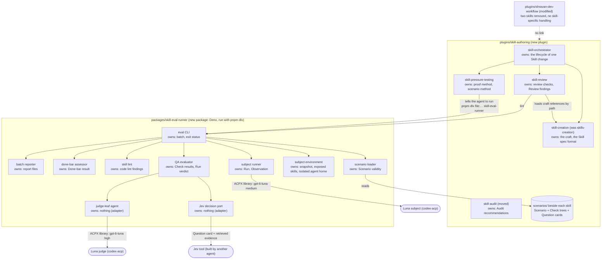
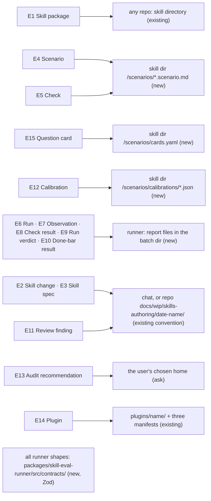
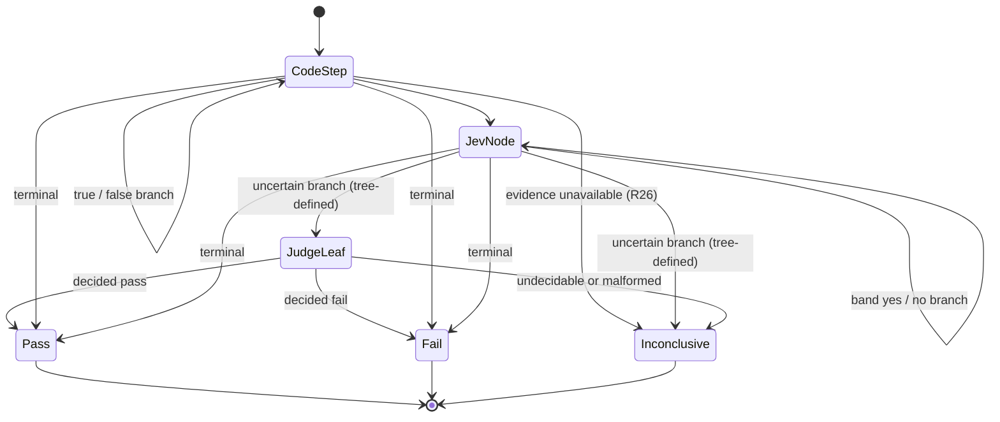

# Skill authoring plugin: Program Design

> **Withdrawn 2026-10-09 (owner decision).** Every part of this design that concerns the eval runner no longer governs: the scenario file, prompt and checks format, the runner's contract shapes, the subject environment, the run from command to verdict, how a Check is decided, lint, done-bar computation, and the runner's rows in the failure, trust-boundary, cutover, requirement, proof-seam and open-item sections. What still governs is the plugin structure: where today's files go (except its rows for `runner-usage.md`, `scenario-authoring.md` and `jev-lint.md`, which were deleted), the five skills and who owns what, and the cutover of skill names. See the matching note in the [Specification](2026-10-02-skill-authoring-plugin.md).

How the system satisfies the [Specification](2026-10-02-skill-authoring-plugin.md) (`E1`–`E15`, `R1`–`R51`), which traces to the [Requirements](user-requirements.md) (`U1`–`U35`). Entity terms follow the Specification; code names appear only in the shape and home cells.

## The system at a glance

Two new homes replace one old one:

- the `skill-authoring` **plugin**: five skills, cut out of today's `skills-creation` and `skill-audit` files, plus their scenarios;
- the `skill-eval-runner` **package**: everything that runs and grades scenarios.

`shravan-dev-workflow` loses both skills and every check that treats a skill as special.



**What changes and what stays.**
- The five skills are mostly today's files in new homes. The genuinely new parts are the orchestration skill's own main path, several reviewer agents plus Jev lint in review, the scenario method, and the runner.
- Grading moves from regexes and one all-criteria judge to one decision tree per Check: code steps over recorded actions, then Jev questions, then a Luna-high judge only at a leaf the tree names.
- The subject still runs through ACPX, now as a library inside the runner's own Deno process, in an isolated agent home that sees only the snapshot's skills.
- The old pressure runner, its scenarios, and its schemas are deleted (hard cutover, `R45`). `tests/skills` keeps only its static skill-contract tests.

## Where today's files go

Every file in `skills-creation` and `skill-audit` was read in full on 2026-10-06. This map is the core of the split; "moved" means the content moves with only the edits named.

| Today | Lines | New home | Edit on the way |
|---|---|---|---|
| `skills-creation/SKILL.md` craft: mental model, four surfaces, invocation, information hierarchy, call grammar, progressive disclosure, leading words, steering, what belongs in `SKILL.md` | 10–128 | `skill-creation/SKILL.md` | role emojis and Operator dispatch removed; the call grammar keeps only the reference forms |
| `skills-creation/SKILL.md` steps 1–5 (promise and success, authoring basis and proof posture, trigger, main path, depth) and step 7 (implement) | 176–247, 253–255 | `skill-creation/SKILL.md` | `discuss-pathfinding` / `practices-research` become "ask the user" / "read the sources"; humanizer loads deleted |
| `skills-creation/SKILL.md` lifecycle: two review stages, convergence rule, accepted boundary, run summary, workflow intro, steps 6, 8, 9, 10, completion blockers | 130–174, 249–251, 257–317 | `skill-orchestrator/SKILL.md` | owner brief becomes "bring the decision to the user"; trace lines deleted |
| `review/spec-review.md` "Spec Artifact" (the Skill spec doc and its slots) | 9–27 | `skill-creation/references/skill-spec.md` | gains the run-status slot (`R8`) |
| `review/spec-review.md` ordered checks, verdicts, blockers, rubric, reduction, labels | 1–8, 29–81 | `skill-review/references/spec-review.md` | points to `skill-spec.md` for the artifact |
| `review/implementation-review.md` | all | `skill-review/references/implementation-review.md` | routing of accepted findings names the owning step instead of a `skills-creation` step |
| `review/lanes/lane-schema.md` | all | `skill-review/references/checks/review-schema.md` | "lane" wording retired; reduction done by the review lead |
| `review/lanes/` nine checks | all | `skill-review/references/checks/<check>.md` | craft loads become `../../../skill-creation/references/…`; the claim ladder load becomes `../../../skill-pressure-testing/references/proof-and-claims.md` |
| `frontmatter-design.md`, `reference-design.md`, `worked-examples.md`, `glossary.md`, `platform-mechanics.md`, `security-gate.md` | all | `skill-creation/references/` | glossary "Lane" entry rewritten; `docs-maintain` and `ops-security-review` pointers become plain needs |
| `reference-lanes-design.md` | all | `skill-creation/references/shared-shape-design.md` | renamed for what it owns |
| `testing/pressure-testing.md` | 1–66, 71–75 | `skill-pressure-testing/references/proof-and-claims.md` | "Running The Suite" (67–70) replaced by `runner-usage.md` |
| (none) | | `skill-pressure-testing/references/scenario-authoring.md` (new) | the work `pressure-testing.md:71` says nobody owns |
| (none) | | `skill-pressure-testing/references/runner-usage.md` (new) | commands, outputs, done bars |
| (none) | | `skill-review/references/jev-lint.md` (new) | the narrow Jev questions and the code that chooses where they apply |
| `skill-audit/SKILL.md` | all | `skill-audit/SKILL.md` | the source-inspiration pointer and the workflow-swarm paragraph become repo-neutral; recommendations gain fix owner, recurrence, and source date (`R42`–`R44`) |
| `agents/openai.yaml` (both) | all | one per new skill | display names under "Skills:" |

**Cross-skill loads stay inside the plugin.** Review judges against the craft, so six review checks load craft references (`trigger-routing` → `frontmatter-design.md`, `placement-and-calls` → `reference-design.md`, `mental-model-fit` and `rule-agreement` → `glossary.md`, `sensitive-surface` → `security-gate.md`, `claim-vs-evidence` → `proof-and-claims.md`). Installed plugins keep skills as siblings, and the runner exposes the whole skill set as siblings too, so relative paths resolve everywhere. Layering inside the plugin: the orchestrator names the other four; creation, review, pressure testing and audit may name each other; none names the orchestrator.

## Choices that shaped the structure

| Crux | Chosen | Rejected, and why | Reopen if |
|---|---|---|---|
| Who owns the Skill spec | `skill-creation`: steps 1–5 write it, and its format already exists at `spec-review.md:9–27` | the orchestration skill. It only carries the spec between runs and records review; it never writes spec content | the orchestrator starts writing spec content |
| Where the craft lives once review is separate | in `skill-creation`, loaded by review by path | a plugin-wide shared folder. That matches `shravan-dev-workflow`'s convention but leaves the craft with no owning skill | a third skill needs the craft |
| How review becomes multi-agent | three reviewer agents, each walking a family of checks in its own session, plus Jev lint; one review lead verifies each candidate at its anchor and reduces | one reviewer walking all checks (today's rule at `glossary.md:28`, `implementation-review.md:23`). The owner asked for several reviewers | review cost outweighs findings on small changes |
| Where grading logic lives | in data: each Check's decision tree and Question cards are declared beside the Scenario; the runner only executes trees | per-scenario TypeScript evaluators. Every scenario would become code | trees need loops or arithmetic the code-step catalog cannot express |
| What the subject sees | a snapshot of the repository at the chosen revision, the skill set copied into `.agents/skills/`, and an isolated agent home with only a link to the user's login | the user's real Codex home. Measured: it loads the personal `AGENTS.md`, 19 installed plugins (one of them the old `skills-creation`) and user skills, about 31k input tokens before the prompt | a host has no file-based login |
| Which Codex the adapter runs | the user's installed `codex` (`CODEX_PATH`), with `codex-acp@1.6.2` pinned | the adapter's bundled Codex. Measured: it rejects `gpt-6-luna` with a 400 while reporting the turn completed | the adapter pin moves |
| How Deno starts under `pnpm dlx` | the package `bin` is a Node shim that runs Deno from the package's own `deno` npm dependency | a `#!/usr/bin/env deno` shebang, which needs a global install (`R50`) | `pnpm dlx` gains a runtime selector |
| Jev before its tool exists | a `JevDecisionPort` with a no-engine adapter that always answers `unavailable`, which falls in the uncertain band (`R32`) | calling OpenRouter Jev directly. That builds the Jev tool here, against the owner's assignment | the Jev tool ships |
| Where results go | `${XDG_CACHE_HOME:-~/.cache}/skill-evals/<repo-slug>/<batch-id>/`, or `--out` | the repository's `tmp/`, which dirties repositories under test | owners want results committed beside scenarios |

**Debt we accept:**
- **Early runs are judge-heavy.** Until the Jev tool and Calibrations exist, every Jev node falls in the uncertain band. *Payer:* run cost. *Closed when:* Calibrations exist per card and engine.
- **`new-from-intent` bars are not evaluable yet.** They need Jev lint (`R38`). *Payer:* the plugin cannot claim its own done bar (`R48`). *Closed when:* the Jev tool ships.
- **Subjects run on Codex only.** *Payer:* skills aimed at other agents are proven only on Codex. *Closed when:* a second ACP adapter is pinned and probed.

## Verified runtime facts (2026-10-06)

Probed with a throwaway script: Deno 2.9.6 from npm, `acpx@0.19.4` `acpx/runtime`, `@agentclientprotocol/codex-acp@1.6.2`, installed Codex CLI 0.160.0, `gpt-6-luna` medium, five calls.

- `createAcpRuntime` → `ensureSession({mode: "oneshot"})` → `startTurn` runs under Deno; turns complete in 8–12 s; usage comes per turn in `result._meta.quota` and `getStatus().usage`.
- A repo-local skill at `<snapshot>/.agents/skills/<name>/SKILL.md` is discovered; asked a triggering question, the subject read that `SKILL.md` (an `execute` tool call naming its path) and followed it.
- `CODEX_HOME` and `HOME` pointed at fresh temporary directories, plus `features.remote_plugin = false`, leave only the snapshot's skills and Codex's bundled skills (`imagegen`, `openai-docs`, `skill-creator`, `skill-installer`); input tokens drop from 31k to 3k. `features.skip_host_skill_discovery` changes nothing. A symlinked `auth.json` is enough to log in.
- A write attempt in the read-only sandbox reaches the client's permission handler as an `execute` request; rejecting it fails the tool call and leaves the snapshot unchanged.
- The adapter's bundled Codex rejects `gpt-6-luna` with HTTP 400 inside the reply text while the turn reports `completed` with empty `model_usage`.

## Where each entity lives



**Conventions found:**
- **Root `AGENTS.md`** and the owner's TypeScript rules: no `any`, explicit types, discriminated unions, `readonly`, Zod derivation (`z.infer`).
- **The current runner** (`tests/skills/lib/.../scenario-case-types.ts:5`) uses plain interfaces and ajv; it is deleted, not followed.
- **The new package** uses Zod 4 schemas as the runtime types; cards and trees keep the field names the orchestration Inspector fixed (`id, serves, evidence, type, question, combine, calibration`).

| E | Semantic owner | Package or module home | Schema/type home | Shape at each boundary | Disposition | Convention |
|---|---|---|---|---|---|---|
| E1 Skill package | the repository that holds it | any repo; `plugins/skill-authoring/skills/<skill>/` for the plugin's own (new) | `runner/src/contracts/skill-ref.ts` (new) | `SkillRef {repoRoot, skillPath}` on CLI input | persisted (git) | Zod |
| E2 Skill change | skill-orchestrator | `plugins/skill-authoring/skills/skill-orchestrator` (new) | the Skill spec's kind field | `kind: "new-from-intent" \| "fix-for-recorded-failure"` passed to `done-bar` | persisted (doc) or chat | Markdown |
| E3 Skill spec | skill-creation (format); skill-orchestrator updates run status | chat, or `docs/wip/skills-authoring/<date-name>/spec.md` | `skill-creation/references/skill-spec.md` (new; from `spec-review.md:9–27`) | slots: targets and runs, problem and evidence, success, decisions, per-run surfaces, basis and proof plan, coordination, non-goals, run status `{run, state: proposed\|implemented\|reviewed\|shipped}`, review record | persisted or chat | Markdown |
| E4 Scenario | scenario loader | `<skill dir>/scenarios/<scenario-id>.scenario.md` (new) | `runner/src/contracts/scenario.ts` (new) | `ScenarioFile` (below) | persisted | Zod |
| E5 Check | scenario loader (validity); QA evaluator (execution) | inside the Scenario file | `runner/src/contracts/check-tree.ts` (new) | `CheckTree` (below) | persisted | Zod discriminated union on `kind` |
| E15 Question card | scenario loader | `<skill dir>/scenarios/cards.yaml` (new) | `runner/src/contracts/question-card.ts` (new) | `QuestionCard` (below) | persisted | Zod, Inspector field names |
| E12 Calibration | QA evaluator (reads); authored offline | `<skill dir>/scenarios/calibrations/<card-id>.<engine>.json` (new) | `runner/src/contracts/calibration.ts` (new) | `Calibration {cardId, engine, labelledSet, measuredAt, bands}` | persisted | Zod |
| E6 Run | subject runner | batch dir | `runner/src/contracts/run.ts` (new) | `RunOutcome` (below) | persisted (report) | Zod |
| E7 Observation | subject runner | batch dir `runs/<run-id>/observation.json` | `runner/src/contracts/observation.ts` (new) | `Observation` (below) | persisted | Zod |
| E8 Check result | QA evaluator | batch dir `runs/<run-id>/checks.json` | `runner/src/contracts/check-result.ts` (new) | `CheckResult` (below) | persisted | Zod |
| E9 Run verdict | QA evaluator | batch dir `runs/<run-id>/verdict.json` | `runner/src/contracts/run-verdict.ts` (new) | `RunVerdict` | persisted | Zod |
| E10 Done-bar result | done-bar assessor | batch dir `done-bar.json` | `runner/src/contracts/done-bar.ts` (new) | `DoneBarResult` (below) | persisted | Zod |
| E11 Review finding | skill-review (review lead) | the Skill spec's review record | `skill-review/references/checks/review-schema.md` (moved from `lane-schema.md`) | Check Finding fields plus `state: candidate\|verified-at-anchor\|accepted\|rejected` | persisted (doc) or chat | Markdown |
| E13 Audit recommendation | skill-audit | the user's chosen home (`R10`) | `skill-audit/SKILL.md` output shape | `{action: update\|create\|merge\|skip, fixOwner: prose\|code-check\|tool, signals[], recurrence, sourceDate}` | persisted (doc) | Markdown |
| E14 Plugin | repository maintainers | `plugins/skill-authoring/` (new); `plugins/shravan-dev-workflow/` (modified) | the three manifest schemas (existing) | three `plugin.json`; three marketplace entries | persisted | existing manifest form |

`packages/skill-eval-runner` is abbreviated `runner/`.

### The scenario file

````markdown
---
scenarioId: skill-creation-draft-artifact      # kebab-case, unique per skill
skill: skill-creation                          # the skill directory the scenarios/ folder sits in
status: active                                 # draft | active | retired
allowWrites: false                             # first pass accepts only false
timeoutSeconds: 600                            # optional
followUps: []                                  # optional scripted user turns, same session
---

## Prompt

Organic user request, exactly as the subject sees it. May invoke a skill by name (`$skill-creation`).

## Checks

```yaml
checks:
  - id: drafts-real-text
    criterion: The reply contains drafted SKILL.md text, frontmatter and body, not a description of it.
    root: drafted
    nodes:
      drafted:
        kind: jev
        card: reply-contains-drafted-skill
        branches: { yes: pass, no: fail, uncertain: judge-drafted }
      judge-drafted:
        kind: judge
        evidence: [finalMessage]
```
````

Sections other than `## Prompt` and `## Checks` are allowed and ignored by the runner; nothing but the Prompt and follow-ups reaches the subject (`R22`). File references in steps and evidence are strings: `skill:<path>` (the scenario's skill), `skill(<name>):<path>` (a sibling skill in the same set), `repo:<path>`.

### Contract shapes the runner exposes

```ts
// runner/src/contracts/check-tree.ts
const nodeRef = z.string();   // a node id, or one of the reserved terminals "pass" | "fail" | "inconclusive"
export const treeNodeSchema = z.discriminatedUnion("kind", [
  z.object({ kind: z.literal("code"), step: codeStepSchema,
             onTrue: nodeRef, onFalse: nodeRef, onUnavailable: nodeRef.default("inconclusive") }),
  z.object({ kind: z.literal("jev"), card: z.string(),
             branches: z.object({ yes: nodeRef, uncertain: nodeRef, no: nodeRef }) }),     // yes_no card
  z.object({ kind: z.literal("jev-choice"), card: z.string(),
             branches: z.record(z.string(), nodeRef), uncertain: nodeRef }),               // choice card
  z.object({ kind: z.literal("judge"), criterion: z.string().optional(),                     // defaults to the Check's criterion
             evidence: z.array(evidenceSourceSchema).default(["finalMessage"]),
             tools: z.array(z.string()).max(0).default([]) }),                             // prescribed tools: later pass
]);
export const checkTreeSchema = z.object({ id: z.string(), criterion: z.string(), root: nodeRef,
                                          nodes: z.record(z.string(), treeNodeSchema) });

// runner/src/contracts/evidence-source.ts: what a card or judge leaf is given, retrieved by code (R26)
export const evidenceSourceSchema = z.union([
  z.literal("finalMessage"),        // the subject's last reply
  z.literal("conversation"),        // every user turn and reply, in order
  z.literal("toolCalls"),           // kind, title, status of every tool call
  z.object({ file: fileRefString }),// a file of the snapshot at the run's revision
]);

// runner/src/contracts/question-card.ts
export const questionCardSchema = z.object({ id: z.string(), serves: z.string(), type: z.enum(["yes_no", "choice"]),
  question: z.string(), options: z.array(z.string()).optional(), evidence: z.array(evidenceSourceSchema).min(1),
  combine: z.unknown().optional() });

// runner/src/contracts/observation.ts
export type Observation = {
  readonly runId: string; readonly scenarioId: string; readonly revision: Revision;
  readonly subject: { readonly model: string; readonly effort: string };
  readonly turns: readonly { readonly index: number; readonly userText: string; readonly assistantText: string; readonly stopReason?: string }[];
  readonly toolCalls: readonly { readonly id: string; readonly turnIndex: number; readonly kind?: string; readonly title: string;
                                 readonly status: "completed" | "failed" | "pending"; readonly inputText?: string; readonly outputText?: string }[];
  readonly permissionRequests: readonly { readonly turnIndex: number; readonly toolCallId?: string; readonly kind?: string; readonly title?: string; readonly decision: "rejected" }[];
  readonly finalMessage: string;
  readonly usage: { readonly inputTokens: number; readonly outputTokens: number; readonly totalTokens: number };
  readonly durationMs: number;
};

// runner/src/contracts/run.ts
export type RunOutcome =
  | { readonly kind: "observed"; readonly runId: string; readonly observation: Observation }
  | { readonly kind: "execution-failed"; readonly runId: string;
      readonly cause: "permission-stop" | "agent-start-failed" | "model-unavailable" | "acpx-error" | "timeout" | "cancelled";
      readonly detail: string };

// runner/src/contracts/check-result.ts
export type CheckResult = {
  readonly checkId: string;
  readonly result: "pass" | "fail" | "inconclusive";
  readonly decidedBy: "code" | "jev" | "judge" | "terminal";
  readonly path: readonly { readonly nodeId: string; readonly kind: TreeNode["kind"];
                            readonly outcome: string; readonly evidence: readonly string[] }[];
};

// runner/src/contracts/run-verdict.ts
export type RunVerdict = "execution-failed" | "inconclusive" | "fail" | "pass";

// runner/src/contracts/done-bar.ts
export type DoneBarResult =
  | { readonly kind: "met"; readonly bar: "new-from-intent" | "fix-for-recorded-failure"; readonly runs: readonly string[] }
  | { readonly kind: "not-met"; readonly reason: "check-failed" | "lint-failed" | "failure-not-reproduced" | "fewer-than-3-passes" }
  | { readonly kind: "not-evaluable"; readonly reason: "execution-failed-run" | "inconclusive-run" | "no-active-scenario" | "jev-lint-unavailable" };

// runner/src/judge/judge-verdict.ts: what the judge agent must return as its whole reply
export type JudgeVerdict =
  | { readonly kind: "decided"; readonly result: "pass" | "fail"; readonly evidenceQuote: string; readonly rationale: string }
  | { readonly kind: "undecidable"; readonly reason: "evidence-insufficient" | "criterion-ambiguous" };
// a malformed or missing judge reply becomes CheckResult "inconclusive" (C3)
```

**The code-step catalog** (`runner/src/qa/code-steps.ts`) is closed, so scenario authors compose and never script. Every step reads recorded actions only; none reads the subject's prose (`R24`):
- `readFile: <fileRef>`: a completed tool call's title or input names the file (by snapshot path, repo-relative path, or exposed skill path);
- `loadedSkill: <name?>`: `readFile` of that skill's `SKILL.md` (default: the scenario's skill);
- `noWritesAttempted: {}`: no permission request and no `edit`, `delete` or `move` tool call;
- `toolCallCount: {max: n}`.

`onUnavailable` fires when the Observation lacks the field a step needs (`R26`).

## The components and who owns what

| Component | Owns (one truth) | Lives in | Interface | Consumers | Changes when |
|---|---|---|---|---|---|
| eval CLI | batch lifecycle and exit status | `runner/src/cli.ts` | `skill-eval-runner validate \| run \| lint \| done-bar` | the skills, any agent | CLI surface changes |
| scenario loader | Scenario/Check/Card validity | `runner/src/scenarios/` | `loadScenarios(SkillRef, ids?) → {kind:"loaded", scenarios} \| {kind:"invalid", errors}` | CLI, QA evaluator | scenario format changes |
| subject environment | the snapshot, the exposed skill set, the isolated agent home | `runner/src/environment/` | `prepareEnvironment(SkillRef, revision) → {kind:"ready", env} \| {kind:"failed", reason}` and `env.dispose()` | subject runner, judge-leaf agent | isolation mechanics change |
| subject runner | Run and Observation | `runner/src/subjects/` | `runSubject(scenario, env, config) → RunOutcome` | CLI, done-bar assessor | ACPX or agent config changes |
| QA evaluator | Check results and Run verdict | `runner/src/qa/` | `evaluateRun(scenario, outcome, ports) → {checks, verdict}` | CLI, done-bar assessor | tree semantics change |
| Jev decision port | nothing (adapter) | `runner/src/jev/` | `ask(card, evidence) → {kind:"answered", value, score} \| {kind:"unavailable", reason}` | QA evaluator, skill lint | the Jev tool's interface changes |
| judge-leaf agent | nothing (adapter) | `runner/src/judge/` | `judge({criterion, request, evidence}) → JudgeVerdict \| {kind:"malformed"}` | QA evaluator | judge prompt or model changes |
| skill lint | code lint findings | `runner/src/lint/` | `lintSkills(skillSetDir, rules) → LintFinding[]` | CLI, done-bar assessor, skill-review | lint rules change |
| done-bar assessor | Done-bar result | `runner/src/done-bar/` | `assess(kind, SkillRef, {base?, head}) → DoneBarResult` | CLI | bar rules change |
| batch reporter | report files and token tally | `runner/src/report/` | `writeBatch(batch) → {dir}` | CLI | report format changes |
| skill-orchestrator (skill) | the lifecycle of one Skill change, run status in the Skill spec | plugin | skill text | authoring agent | authoring workflow changes |
| skill-creation (skill) | the craft; the Skill spec format | plugin (moved, renamed) | skill text | orchestrator, author, skill-review | craft rules change |
| skill-review (skill) | review checks, Review findings, reduction | plugin (moved checks, new main path) | skill text, plus `lint` | orchestrator | review method changes |
| skill-pressure-testing (skill) | proof method and scenario method | plugin (moved method, new scenario method) | skill text, plus `run` and `done-bar` | orchestrator, author | proof or scenario method changes |
| skill-audit (skill) | Audit recommendations | plugin (moved) | skill text | owner, author | audit method changes |

**Forbidden edges**, enforced by `lint` rules and a repository search (`V2`):
- plugin skills naming `shravan-dev-workflow` skills or files, and the reverse;
- `qa/` importing `subjects/` or `environment/` (it reads only `RunOutcome`);
- `judge/` importing `jev/` (`R33`): the judge input type has no field for a Jev answer;
- any runner module writing inside the repository under test.

### How the subject environment is built (R30, R51)

1. **Snapshot.** `working-tree` (default) copies every tracked and untracked-not-ignored file (`git ls-files -co --exclude-standard -z`) into a fresh temporary directory; a commit revision uses `git archive <rev> | tar -x`. The snapshot is then made a one-commit git repository so the agent sees an ordinary checkout. The repository under test is never written.
2. **Expose the skill set.** The skill under test's parent directory is its skill set (for plugins, `<plugin>/skills/`). Every sibling directory holding a `SKILL.md` is copied to `<snapshot>/.agents/skills/<name>/`; a `shared-references/` beside the skill set is copied to `<snapshot>/.agents/shared-references/`, so `../../shared-references/` paths still resolve. A skill already under `.agents/skills/` or `.codex/skills/` is used in place. A name that already exists there is `failed(skill-name-conflict)`.
3. **Isolate the agent home.** Fresh `0700` directories for `CODEX_HOME` and `HOME`; `CODEX_HOME/auth.json` is a symlink to the user's `${CODEX_HOME:-~/.codex}/auth.json`. The runner checks only that the link target exists; it never reads, copies, or logs it (security decision: allowed, link only). No file-based login → `failed(no-agent-login)`.
4. **Launch settings.** Agent argv `[node, <codex-acp@1.6.2 bin from the runner's own dependencies>]`; environment `CODEX_HOME`, `HOME`, `CODEX_PATH` (`--codex-path`, else `codex` on `PATH`, else `failed(codex-not-found)`), `INITIAL_AGENT_MODE=read-only`, and `CODEX_CONFIG` = `{model, model_reasoning_effort, approvals_reviewer: "user", features: {hooks: false, remote_plugin: false}}`.
5. **Dispose.** The runner deletes only the temporary directories it created, after the Run's files are written.

## One run, from command to verdict

```mermaid
sequenceDiagram
  autonumber
  participant A as Agent (via skill-pressure-testing)
  participant C as eval CLI
  participant L as scenario loader
  participant E as subject environment
  participant R as subject runner
  participant X as ACPX runtime (library)
  participant Q as QA evaluator
  participant J as Jev decision port
  participant G as judge-leaf agent
  participant P as batch reporter
  A->>C: pnpm dlx file:…/skill-eval-runner run --repo R --skill P --runs N
  C->>L: loadScenarios(SkillRef)
  L-->>C: loaded | invalid(errors) → exit 2, no subject runs (R22–R24)
  par N runs, fresh sessions (R35)
    C->>E: prepareEnvironment(SkillRef, revision)
    E-->>C: ready(snapshot, exposed skills, isolated home) | failed → execution-failed
    C->>R: runSubject(scenario, env, gpt-6-luna medium)
    R->>X: createAcpRuntime + oneshot session; permission handler rejects and records (R30)
    X-->>R: tool calls, permission requests, text, usage
    R-->>C: observed(Observation) | execution-failed(cause) (R36)
    C->>Q: evaluateRun(scenario, outcome)
    loop each Check tree
      Q->>Q: code steps over the Observation (R24, R26)
      Q->>J: ask(card, retrieved evidence)
      J-->>Q: answered(score) | unavailable → band via Calibration (R32)
      opt tree reaches a judge leaf
        Q->>G: criterion + request + evidence only (R33)
        G->>X: oneshot session, gpt-6-luna high, empty cwd, all tools denied
        G-->>Q: decided(pass|fail) | undecidable | malformed → inconclusive
      end
    end
    Q-->>C: CheckResult[] + RunVerdict (R37)
    C->>E: dispose()
  end
  C->>P: write batch (verdicts, judge-leaf rate, tokens)
  C-->>A: exit 0 all pass | 1 any not pass | 2 invalid input or environment
```

**Current → proposed delta** (current anchors under `tests/skills/lib/skill-pressure-evaluation/`):

| Edge | Status | Current | Proposed |
|---|---|---|---|
| entry | changed | `pnpm --dir tests/skills run test:evals` → vitest → `evals/skill-pressure.eval.ts` | `pnpm dlx file:…/skill-eval-runner run`; no test framework in the run path |
| scenario load | changed | `scenario-cases/parse-scenario-fixture.ts` reads `tests/skills/pressure-scenarios/<plugin>/<skill>/*.md` with `expect_*` regex fields | the loader reads `<skill dir>/scenarios/*.scenario.md`; `expect_*` fields are rejected (`R45`) |
| subject prompt | changed | `subject-execution/render-subject-prompt.ts:24` opens with "You are running a Codex skill pressure test" and asks for a self-report JSON | the subject gets the Prompt text only; no wrapper, no self-report (`R22`, `R23`) |
| subject start | changed | `agent-execution/acpx-codex-agent-runner.ts:286` spawns the `acpx` CLI in the real repo with the user's Codex home | `acpx/runtime` in-process, in the subject environment above; the codex-acp pin and read-only mode are kept |
| deterministic gate | removed | `evaluators/deterministic/legacy-pressure-assertions.ts` regexes and self-report fields | none; code steps read recorded actions only |
| semantic judge | removed | `evaluators/semantic/semantic-criteria-evaluator.ts`: one judge call over all criteria at `xhigh` | per-Check judge leaf at `high`, only where the tree reaches one |
| verdict | changed | per-row vitest pass/fail; the semantic overall puts inconclusive before fail (`semantic-criteria-evaluator.ts:411-419`) | `RunVerdict` aggregation (`R37`): any fail makes the Run `fail`, then any inconclusive makes it `inconclusive` |
| results | changed | `tmp/skill-pressure-evals/` in the ai-tools repo | the batch dir outside the repository |

## How a Check is decided



**Loader checks on every tree:** every reference resolves; the graph is acyclic; every path ends in a terminal or a judge leaf; every `jev` node names a card the skill's `cards.yaml` declares with the matching type; every file reference resolves in the repository at load time.

**Banding (`R32`):**
- The QA evaluator, not the Jev tool, turns a score into a band, using `<card>.<engine>.json`.
- With no Calibration file, or an `unavailable` answer, the band is `uncertain`.
- The evaluator never passes a Jev answer onward (`R33`).

**The judge prompt** (`runner/src/judge/judge-prompt.ts`) carries the user's request (Prompt and follow-ups), the criterion, and the retrieved evidence. It tells the judge to decide only what the request asked (`R25`) and to reply with exactly one `JudgeVerdict` JSON object. The judge session runs in an empty temporary directory with every permission request rejected.

## Lint

`skill-eval-runner lint --skill-set <dir> [--forbid <word>]…` runs code checks over a skill set and reports candidate findings (`path:line`, rule, message):
- `name` equals the directory name; `description` exists, is at most 1024 characters, and starts with "Use when";
- every backticked relative `.md` path in a skill file (`references/…`, `./…`, `../…`) resolves;
- no forbidden word appears (for `R3`: `shravan-dev-workflow` in the plugin; the old plugin-qualified names repository-wide).

Jev lint cards (duplicated rule, a rule losing its home, trigger overlap; `R19`) run through the same `JevDecisionPort`; until the tool ships they are reported `not-run: no Jev engine`. Lint findings are candidates: `skill-review` verifies each at its anchor like any other finding (`R17`).

## Done bars

| Bar | Flow (done-bar assessor) | Result |
|---|---|---|
| new-from-intent (`R38`) | `lint` (code rules, then Jev cards) over the changed skills, then one run per active Scenario at `head` | `met` if lint passes and every Scenario has a `pass` run; `not-evaluable(jev-lint-unavailable)` while Jev cards cannot run |
| fix-for-recorded-failure (`R39`) | snapshot `base`, run the named Scenario once and expect `fail`; snapshot `head`, run 3 fresh sessions and expect `pass` × 3 | `met`, `not-met(failure-not-reproduced \| fewer-than-3-passes \| check-failed)` |
| any bar (`R40`) | any `execution-failed` or `inconclusive` Run | `not-evaluable`, never `met` |
| improvement claim (`R41`) | the same Scenarios at `base` and `head`, reported side by side | a report section, not a bar |

## Failure, partial success and concurrency

| Boundary | Detection | Contained as | Recovery owner | Proof |
|---|---|---|---|---|
| scenario invalid | loader validation | `invalid(errors)`, exit 2, no Run started | author fixes the file | V5 |
| snapshot or exposure fails | `git` exit, unknown rev, name conflict | that Run `execution-failed(agent-start-failed)` with the reason | user | V6 |
| no login or no Codex | link target or `codex` missing | exit 2 before any Run, naming the fix | user | V6 |
| agent fails to start, times out, or is cancelled | runtime error, timeout, signal | `execution-failed(cause)` for that Run only | user reruns; other Runs keep results | V6, V9 |
| the model never ran | turn `completed` with zero token usage | `execution-failed(model-unavailable)` with the reply text as detail | user (model or Codex version) | V6 |
| subject tries to write | permission handler | request rejected and recorded; the Run continues | none needed (`R30`) | V9 |
| Jev unavailable | port returns `unavailable` | uncertain band, so the tree's uncertain branch | none | V7 |
| judge malformed or silent | strict JSON parse or timeout | that Check `inconclusive` | user reruns | V6 |
| cancel a batch (Ctrl-C) | signal | finished Runs written; unstarted Runs reported not run | user | V6 |

**Parallel Runs:** each has its own environment, ACPX runtime, session and process: no shared history or mutable state (`R35`). The reporter writes per-run files and aggregates once at the end. `--parallel` (default 3) is backpressure on local CPU and agent quota.

## Trust boundary

- **Subjects can't write** (`R30`): read-only sandbox, a permission handler that rejects every escalation, and a snapshot copy, so nothing reaches the repository under test.
- **Subjects see nothing of the host** (`R51`): isolated `CODEX_HOME` and `HOME`; remote plugins off; only the snapshot's skills exposed.
- **The login is linked, never handled:** the only host credential path is the `auth.json` symlink target; the runner checks existence only.
- **The judge is isolated:** its own session in an empty directory; it sees only the request, criterion, and evidence; it never sees subject identity, revision labels, or Jev answers.
- **Secrets stay out of Jev:** evidence is assembled by code; the loader rejects card evidence that names files matching the credential pattern (`credential|escrow|token|secret|password|keychain|auth|api.?key|private.?key`), per the owner's standing rule.
- **Nothing gets installed** (`R49`, `R50`): `pnpm dlx` runs the package in a temporary environment; Deno and codex-acp come from the package's own dependencies; the user's existing `codex` is used, never installed.

## Cutover

**Plugin split, with nothing coexisting:**
1. Create `plugins/skill-authoring/` with three manifests, a README, and marketplace entries in `.agents/plugins/marketplace.json`, `.claude-plugin/marketplace.json`, and `.cursor-plugin/marketplace.json` (the Cursor file uses `pluginRoot` plus a relative source, so the entry follows its shape).
2. Build the five skills from the file map above.
3. In `shravan-dev-workflow`:
   - delete `skills/skills-creation/` and `skills/skill-audit/`;
   - delete the skill-package check and its `skills-creation` gate from `spec-design`, `program-design`, `plan-implementation`, `implement-plan`, `plan-improve-repo`, `spec-program-review` (and its `classifying-review-requirement.md`), `implementation-review`, `implementation-pr-wrapup`, `implementation-handoff` (and two references), `docs-maintain`, `discuss-clarify-mental-models`, `practices-research` (and `evidence-ledger.md`), and `orchestrator-implementation-goal` (and `goal-contract-and-routing.md`);
   - delete the `runtime-skill-package` classification from `shared-references/phase-return-tokens.md`, so `ready-for-review` always means implementation review;
   - update the three manifests' skill lists, the plugin README, and `shared-references/humanizer.md`'s consumer list; bump the version.
   - The maintainer of work breakdown and skill review owns four of these files and reviews that diff before merge.
4. Update the repository `AGENTS.md` Skill Work SOP and skills table to the new plugin and names.

**Scenario cutover (`R45`–`R47`):**
- Add `packages/skill-eval-runner/`.
- Delete the pressure runner from `tests/skills`: `lib/skill-pressure-evaluation/`, `evals/`, `schemas/`, `pressure-scenarios/`, `retired-pressure-scenarios/`, and fixtures used only by them. Keep the static contract tests and their fixtures; remove from them only assertions about the deleted scenario files.
- Rewrite the 16 moved Scenarios in the new form beside their skills.
- Rewrite a proving set of four `shravan-dev-workflow` scenarios, one per Check shape: `manage-agents-custom-agent-boundary` (code-heavy), one `spec-design` (judge leaf), one `implementation-review` (several cards), one `discuss-pathfinding` (choice card).
- List every other old scenario in `docs/wip/skills-authoring/2026-10-06-unconverted-scenarios.md` as not running, so none is reported as passing.

**Delivery slices** (a `gh stack` on top of the design PR):
1. the design (this document and its siblings);
2. the plugin split and the `shravan-dev-workflow` cutover (one hard cutover);
3. the runner package, the converted scenarios, and the pressure-runner deletion.

## How each requirement works and how we verify it

| U | R | E | owner | interface | shape and home | state | failure | proof |
|---|---|---|---|---|---|---|---|---|
| U1, U4 | R1 five skills exist | E1, E14 | plugin | skill directories | five `SKILL.md` under `plugins/skill-authoring/skills/` | none: static | none: static | V1 install transcript |
| U2 | R2 loads without sdw | E14 | plugin | manifests | three `plugin.json` | none: static | none: static | V1 |
| U2 | R3 no cross-names | E14 | plugin + sdw | lint `--forbid` + search | lint rules | none: static | lint finding | V2 |
| U2 | R4 no skill handling in sdw | E14 | sdw skills | none: the check is removed | `phase-return-tokens.md` (modified) | none | none | V3 search |
| U1, U12 | R5 old names gone | E14 | repo | search | — | none: static | search hit | V2 |
| U3 | R6 any repo | E1 | eval CLI | `--repo`, `--skill` | `SkillRef` | none | `invalid(unknown-path)` | V1, V5 |
| U10, U14 | R7 read before claiming | E1 | skill-orchestrator | step 1 | orchestrator `SKILL.md` | none: method | review rejects unread claims | V4 |
| U10, U13 | R8 run status | E2, E3 | skill-creation (format), skill-orchestrator (updates) | Skill spec run status | `skill-creation/references/skill-spec.md` | proposed→implemented→reviewed→shipped | a run not shown shipped is never reported shipped | V4 |
| U10, U20 | R9 independent check | E2, E11 | skill-review | reviewer agents with no authoring history | `skill-review/SKILL.md` | candidate→verified→accepted/rejected | no second agent → not reviewed | V4 |
| U10 | R10 ask for other practices | E2 | skill-orchestrator | ask step | orchestrator `SKILL.md` | none | none | V4 |
| U15 | R11 write vs proof | E2 | skill-creation | authoring basis | step 2 | basis fixed at authorization | intent-first never blocked for no RED | V4 |
| U16 | R12 triggers | E1 | skill-creation, skill-review | `frontmatter-design.md`, `trigger-routing` check, Jev trigger-overlap card | `cards.yaml` | none | finding | V4, V7 |
| U17 | R13 reachable teaching | E1 | skill-creation, skill-review | `depth-coverage`, `placement-and-calls`, lint path rule | lint rules | none | finding | V4 |
| U18 | R14 one home per rule | E1, E2 | skill-review | `rule-agreement`, Jev duplicated-rule card | lint cards | none | finding | V4, V7 |
| U19 | R15 proportionate | E2 | skill-creation | `worked-examples.md`, craft | `SKILL.md` | none | finding | V4 |
| U4 | R16 multi-reviewer + Jev lint | E11 | skill-review | three reviewer agents + `lint` | `skill-review/SKILL.md` | finding states | one reviewer only → not reviewed | V4 |
| U20 | R17 verify at anchor | E11 | skill-review lead | verify step | `review-schema.md` finding state | candidate→verified | unverified → not accepted | V4 |
| U21 | R18 separate properties | E11 | skill-review | check families | `checks/*.md` | none | none | V4 |
| U22 | R19 narrow Jev lint | E5, E11, E15 | skill lint | `lint` | lint cards; applicability by code | none | Jev unavailable → not-run | V7 |
| U20 | R20 count ≠ verification | E11 | skill-review lead | reduction rule | `skill-review/SKILL.md` | none | none | V4 |
| U11 | R21 beside the skill | E4 | scenario loader | discovery | `<skill>/scenarios/*.scenario.md` | none | not found → `invalid` | V5 |
| U25 | R22 organic prompt | E4, E6 | scenario loader | banned-word check | `contracts/scenario.ts` | none | `invalid(banned-word)` | V5 |
| U6 | R23 decision tree | E5, E15 | scenario loader | tree validation | `contracts/check-tree.ts` | none | `invalid(tree)` | V5 |
| U6, U23 | R24 no text matching | E5, E7 | scenario loader + QA evaluator | closed code-step catalog | `qa/code-steps.ts` | none | unknown step → `invalid` | V5 |
| U24 | R25 prompt scope | E5, E8 | judge-leaf agent | judge prompt | `judge/judge-prompt.ts` | none | finding in review | V4, V8 |
| U26 | R26 retrieve, else inconclusive | E5, E7, E8 | QA evaluator | evidence sources | `contracts/evidence-source.ts` | none | missing → `onUnavailable` | V6 |
| U30 | R27 one subject run | E6, E7 | subject runner | `runSubject` | `RunOutcome` | started→observed / execution-failed | — | V9 |
| U7 | R28 models | E6, E8 | subject runner, judge-leaf agent | launch settings | `subjects/agent-launch.ts` | none | model never ran → `model-unavailable` | V9 |
| owner 10-04 | R29 ACPX library | E6 | subject runner | `acpx/runtime` | `package.json` dependency | none | import failure → exit 2 | V9 |
| U28 | R30 read-only | E6, E7 | subject runner | permission handler | `Observation.permissionRequests` | none | rejected, recorded | V9 |
| U8 | R31 follow bands | E5, E8, E15 | QA evaluator | `evaluateRun` | `TreeNode` branches | node→node | — | V6, V7 |
| U8 | R32 calibrated bands | E12, E15 | QA evaluator | band mapping | `contracts/calibration.ts` | none | no file → uncertain | V7 |
| U8, U20 | R33 judge isolation | E8, E15 | judge-leaf agent | `judge()` input type has no Jev field | `judge/judge-input.ts` | none | — | V8 |
| U5 | R34 no judge unless leaf | E8, E9 | QA evaluator | tree walk | `CheckResult.decidedBy` | none | — | V7 |
| U7, U29 | R35 parallel, fresh | E6 | eval CLI | `--parallel` | one environment and session per Run | none | one Run's failure isolated | V9 |
| U28 | R36 execution-failed | E9 | subject runner | `RunOutcome.execution-failed` | `contracts/run.ts` | started→execution-failed | cause recorded | V6 |
| U27, U28 | R37 verdict order | E8, E9 | QA evaluator | aggregation | `RunVerdict` | none | earlier fail kept | V6 |
| U9 | R38 new bar | E10 | done-bar assessor | `assess(new-from-intent)` | `DoneBarResult` | none | `not-evaluable(jev-lint-unavailable)` today | V4 |
| U9 | R39 fix bar | E10 | done-bar assessor | `assess(fix…)` | `DoneBarResult` | base fail → head pass ×3 | `failure-not-reproduced` | V10 |
| U28 | R40 not evaluable | E9, E10 | done-bar assessor | bar rule | `DoneBarResult.not-evaluable` | none | — | V6 |
| U29 | R41 improvement claim | E9 | batch reporter | base vs head section | report | none | — | V10 |
| U31 | R42 audit actions | E13 | skill-audit | output shape | `skill-audit/SKILL.md` | none | — | V4 |
| U32 | R43 fix owner | E13 | skill-audit | `fixOwner` field | same | none | — | V4 |
| U33 | R44 sourced lessons | E13 | skill-audit | source and date fields | same | none | — | V4 |
| U6, U12 | R45 new form only | E4 | scenario loader | rejects `expect_*` | `contracts/scenario.ts` | none | `invalid(legacy-form)` | V5 |
| owner 10-04 | R46 16 + proving set | E4 | plugin + sdw | scenario files | `scenarios/` dirs | draft→active | — | V11 |
| owner 10-04 | R47 unconverted listed | E4, E9 | repo | inventory doc | `docs/wip/skills-authoring/2026-10-06-unconverted-scenarios.md` | none | — | V11 |
| acceptable evidence | R48 own done bars | E10 | done-bar assessor | `assess` over plugin skills | `DoneBarResult` | none | not evaluable until Jev lint | V11 |
| U34, U35 | R49 own package, pnpm dlx | E14 | eval CLI | `bin` shim → Deno | `packages/skill-eval-runner/package.json` | none | — | V12 |
| U35 | R50 no installs | E1, E14 | plugin skills | skill text + search | install-command search | none | search hit | V12 |
| U3, U7, U25 | R51 isolated subject | E6 | subject environment | `prepareEnvironment` | `environment/` | none | `failed(reason)` → no Run | V9 |

## Proof seams

| Seam | Real | Replaced | Observation |
|---|---|---|---|
| loader validation (V5) | parser, schemas | nothing | `invalid(errors)` before any process starts |
| QA evaluator (V6, V7) | tree walk, banding, aggregation | recorded Observations and a scripted `JevDecisionPort` | `CheckResult.path`, `RunVerdict` |
| judge isolation (V8) | judge prompt builder | the ACPX session replaced by a capturing fake | captured input has no Jev answer, score, or route |
| subject environment (V9) | snapshot, exposure, isolated home | nothing | a real Luna run lists only the snapshot's and built-in skills; a write is rejected and recorded |
| subject runner (V9) | `acpx/runtime`, codex-acp pin, Deno | nothing | two parallel real runs, no shared history |
| plugin load (V1) | Claude Code and Codex installs | nothing | install and invocation transcripts with sdw absent |
| done bars (V10, V11) | the whole runner | nothing | `done-bar.json` with run ids |

**Illegal states kept out:**
- **Unrepresentable (Zod):** a judge leaf with tools (first pass); a `RunVerdict` of `pass` with a failing `CheckResult` (aggregation derives it).
- **Rejected at the loader:** a regex or `expect_*` field, a banned word, a tree that cannot reach a terminal, an unknown card or step, an evidence file matching the credential pattern, `allowWrites: true` (first pass).
- **Rejected at runtime:** a subject write, by the permission handler.

## Open items

- **Codex only.** The isolation recipe is Codex-specific; a second adapter needs its own probe.
- **Hosts without a file-based login** (keyring credentials) get `no-agent-login`; a keyring route is not designed.
- **Prescribed judge tools** (`R33`'s code-execution or composition case) are rejected by the loader until a scenario needs them.
- **The Jev tool's interface** is unverified. `JevDecisionPort` mirrors a question-card-plus-evidence call; only the adapter changes when the tool ships.
- **Where Audit recommendations live (E13)** is the user's choice per run (`R10`).
