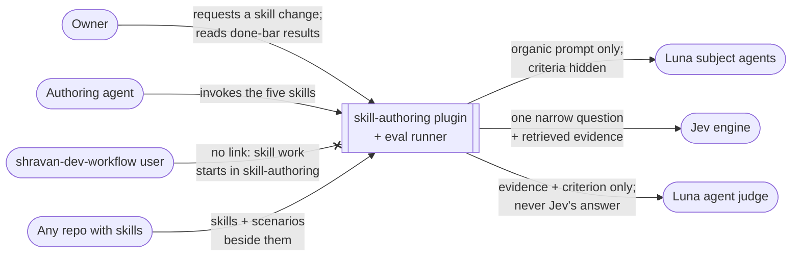
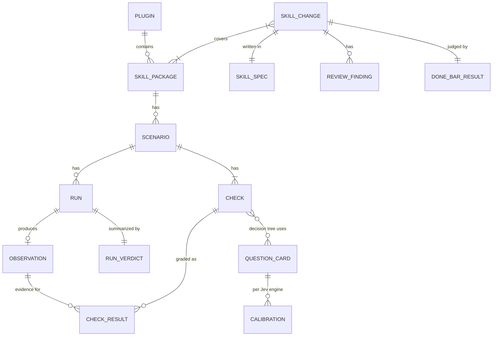

# Skill authoring plugin: Specification

> **Withdrawn 2026-10-09 (owner decision).** The eval runner, Scenarios, Checks, Question cards, Jev, the agent judge, runner lint, and runner-computed Done-bar results do not ship. R19, R21, R23, R24, R26–R40, R45–R49 and R51 no longer govern, nor do the Jev-lint half of R16, surfaces C2–C4, or the proof obligations and coverage rows that rest on them. What still governs: R1 as four skills (`skill-pressure-testing` is dropped; its proof-and-claims reference moves to `skill-creation`), R2–R15, R16 (more than one reviewer agent), R17, R18, R20, R42–R44, R50, and surfaces C1 and C5; R22 (an organic request that never shows the checks, never says it is a test, and never asks which skills or files the agent used; its list of banned words was a runner validation rule and is withdrawn), R25 and R41 remain as practice `skill-creation`'s proof reference keeps, with no runner enforcing them. In place of R51's runner guarantee, that reference makes the author confirm which copy of a skill each run loaded. The plugin's own skills carry no runner-measured proof; that gap stays open until the redesign. See the matching note in [user-requirements.md](user-requirements.md).

What must be observably true of the standalone `skill-authoring` plugin and its eval framework. Why, for whom, and the confirmed boundary live in [user-requirements.md](user-requirements.md) (rows `U1`–`U35`). How it is built lives in the Program Design beside this file.

## The model in one picture

The plugin is one opaque system here. The crossed edge is negative space: `shravan-dev-workflow` has no skill-specific handling and never names a `skill-authoring` skill (`U2`).

## Domain entities

The entity table is normative. Program Design binds these to files, schemas, and code.

| ID | Entity | Identity rule | Relationships | Invariants | Observable states | Basis |
|---|---|---|---|---|---|---|
| E1 | **Skill package** | one directory holding a `SKILL.md`, identified by its repository and its path in that repository; the same path at another revision is the same package at a different revision | belongs to one repository; has 0..n Scenarios (E4); may belong to one plugin (E14) | its references and scripts live inside its own directory | (none) | U1, U3 |
| E2 | **Skill change** | one owner-authorized change to one or more Skill packages; a later, separately authorized request is a new Skill change even when it touches the same packages | covers 1..n E1; has exactly 1 Skill spec (E3); has 0..n Review findings (E11); has 1 Done-bar result (E10) | its kind is fixed when authorized: `new-from-intent` or `fix-for-recorded-failure` | proposed → implemented → reviewed → shipped; or abandoned from any state before shipped | U9, U13, U15 |
| E3 | **Skill spec** | one per Skill change: its promise, success definition, authoring basis, which surface (trigger, main path, depth, proof) carries each part, decisions, and runs in order | belongs to exactly one E2 | each run in it carries exactly one of proposed, implemented, reviewed, shipped; a decision once recorded is superseded by a later entry, never rewritten; it is a document whenever the change spans more than one run, carries decisions a later run must honor, or must outlive the session, and otherwise stays in the conversation | (follows its runs) | U4, U10, U13 |
| E4 | **Scenario** | one pressure scenario for exactly one Skill package, identified by that package plus a scenario id stable across edits | belongs to 1 E1; has 1..n Checks (E5); has 0..n Runs (E6) | stored beside its Skill package; its checklist is never part of what the subject sees | draft → active → retired | U6, U11, U25 |
| E5 | **Check** | one checklist item in one Scenario, identified by that scenario plus a check id | belongs to 1 E4; is decided by exactly 1 decision tree whose Jev nodes use Question cards (E15) | its decision tree is made of code steps and Jev questions whose branches are named bands (yes / uncertain / no, or high / mid / low); every path ends in pass, fail, inconclusive, or a judge leaf; it names the evidence each node needs | (none) | U6, U8, U26 |
| E6 | **Run** | one execution of one Scenario against one Skill package revision by one subject configuration; two Runs are fresh when neither shares conversation history with the other | belongs to 1 E4; produces 0..1 Observation (E7) | the subject is a Luna agent | started → observed, or started → execution-failed | U7, U29, U30 |
| E7 | **Observation** | the recorded behaviour of exactly one Run | belongs to 1 E6; read by every Check result (E8) of that Run | immutable once recorded; holds what the subject did (tool calls, files read, artifacts written) apart from what it said | (none) | U23, U30 |
| E8 | **Check result** | one Check applied to one Observation | belongs to 1 E5 and 1 E7 | carries the evidence it relied on and which grader decided it | pass, fail, or inconclusive; decided by `code`, by `jev` (certain), or by `judge` | U8, U23, U24 |
| E9 | **Run verdict** | one per Run | summarizes the E8 results of 1 E6 | a fail or inconclusive result is never replaced by a later pass | execution-failed, inconclusive, fail, or pass | U27, U28 |
| E10 | **Done-bar result** | one per Skill change, at the revision being judged | belongs to 1 E2; reads E9 verdicts of its packages' Scenarios | uses the bar for its change kind | met, not met, or not evaluable | U9 |
| E11 | **Review finding** | one candidate defect at one anchor (file and line or section) in one Skill change, raised by a reviewer agent or a Jev lint check | belongs to 1 E2 | names the review check that raised it, and so the property it concerns: teaching, trigger, rule agreement, placement, claim strength, or safety | candidate → verified-at-anchor → accepted or rejected | U20, U21, U22 |
| E12 | **Calibration** | one Jev engine plus one Question card, measured on one labelled set | belongs to 1 E15 | the labelled set was not used to write the Check's question; recorded with its engine, date, and set | (none) | U8, U22 |
| E13 | **Audit recommendation** | one recommendation for one signal about one or more Skill packages | cites 1..n recorded signals | names its action and the owner of the fix, with recurrence evidence | update, create, merge, or skip; fix owner: prose, a code check, or the tool | U31, U32, U33 |
| E15 | **Question card** | one predefined Jev question, identified by a card id stable across edits | used by 1..n Checks (E5) and by the judge's prescribed tools; has 0..n Calibrations (E12), one per engine | asks one judgement over named evidence; its type is yes/no or choice; it never asks whether work is good overall | (none) | U8, U22, owner 10-06 |
| E14 | **Plugin** | one installable unit, identified by its plugin name | contains 0..n E1 | `skill-authoring` and `shravan-dev-workflow` name none of each other's skills or files | (none) | U1, U2 |

The map shows domain relationships only; states and identity rules are in the table.

## Requirements

Each requirement names the entities it is written over and the user rows it serves. "The plugin" means `skill-authoring` and its eval runner together.

### Packaging and standalone use

| ID | Requirement | Entities | Basis |
|---|---|---|---|
| R1 | The plugin MUST provide exactly five skills: `skill-orchestrator`, `skill-creation`, `skill-review`, `skill-pressure-testing`, and `skill-audit`. | E1, E14 | U1, U4 |
| R2 | The plugin MUST load and run with `shravan-dev-workflow` not installed, in Claude Code and in Codex. | E14 | U2 |
| R3 | Files in the plugin MUST NOT name a `shravan-dev-workflow` skill or load a `shravan-dev-workflow` file, and files in `shravan-dev-workflow` MUST NOT name a `skill-authoring` skill. | E14 | U2 |
| R4 | `shravan-dev-workflow` MUST contain no skill-package classification, gate, or routing: its phases treat a skill like any other target, and `ready-for-review` always means ordinary implementation review. | E14 | U2, owner 10-06 |
| R5 | After the cutover, `skills-creation` and `skill-audit` MUST no longer exist in `shravan-dev-workflow`; `skills-creation` is renamed `skill-creation`, and active files in this repository MUST NOT refer to the old plugin-qualified names. | E14 | U1, U12 |
| R6 | The plugin MUST work on Skill packages in any repository, at any path the user names. | E1 | U3 |
| R49 | The eval runner MUST be a package of its own, separate from the plugin's skills, and MUST be run with `pnpm dlx` (a local `file:` package spec until it is published, then its published name). | E14 | U34, U35 |
| R50 | Skills in the plugin MUST NOT install an executable, a global tool, or a dependency into the repository under test; anything a skill runs goes through `pnpm dlx`. | E1, E14 | U35 |

### Authoring practices the plugin carries

| ID | Requirement | Entities | Basis |
|---|---|---|---|
| R7 | Before an authoring agent states a fact about a Skill package, the plugin MUST lead it to read that package's current files; a claim about content not read in the current revision is not made. | E1 | U10, U14 |
| R8 | Every Skill change MUST have a Skill spec that shows each run as proposed, implemented, reviewed, or shipped; a run not shown as shipped is never reported as shipped. | E2, E3 | U10, U13 |
| R9 | Every behaviour-changing Skill change MUST be checked by a second agent that did not write it, before it is reported as reviewed. | E2, E11 | U10, U20 |
| R10 | For any general practice other than R7–R9 (for example board traces, decision-brief formats, or prose rewriting), the plugin MUST ask the user instead of assuming one. | E2 | U10 |
| R11 | A Skill change's authorization to be written MUST be recorded separately from its proof of working; an intent-first change is never blocked for lacking a reproduced failure. | E2 | U15 |

### Skill creation

| ID | Requirement | Entities | Basis |
|---|---|---|---|
| R12 | A created or edited Skill package's description MUST route its own requests to it and send near-miss requests elsewhere, before its body is loaded. | E1 | U16 |
| R13 | Every reference a Skill package's main path relies on MUST be reachable from that main path, and MUST teach how to do the work, not only list fields. | E1 | U17 |
| R14 | A rule shared by several Skill packages MUST have one home; a change to it MUST update every package that uses it in the same Skill change. | E1, E2 | U18 |
| R15 | The ceremony a Skill change adds MUST be proportionate to the job it teaches; universal fields or proof steps the job does not need are not added. | E2 | U19 |

### Skill review

| ID | Requirement | Entities | Basis |
|---|---|---|---|
| R16 | Skill review MUST use more than one reviewer agent and Jev lint checks. | E11 | U4 |
| R17 | A Review finding MUST be verified at its anchor in the current revision before it is accepted; an absence claim requires opening the file where the item would be. | E11 | U20 |
| R18 | Review MUST judge teaching, trigger, rule agreement, placement, claim strength, and safety as separate properties; passing one never implies another. | E11 | U21 |
| R19 | Jev lint checks MUST ask narrow questions (duplicated rule, rule lost its home, trigger overlap), with the files they apply to chosen by code; Jev never judges whether a finding is valid. | E5, E11 | U22 |
| R20 | The number of reviewers who agree MUST NOT stand in for verification; accepted requirements outrank reviewer consensus. | E11 | U20 |

### Scenarios and checks

| ID | Requirement | Entities | Basis |
|---|---|---|---|
| R21 | A Scenario MUST be stored beside its Skill package and selected by its scenario id. | E4 | U11 |
| R22 | What the subject sees MUST read as an organic user request: it never contains the checklist, and never the words eval, test, judge, experiment, rubric, score, compare, benchmark, candidate, or arena, nor a question about which skills or files it used. | E4, E6 | U25 |
| R23 | Every Check MUST be decided by a decision tree of code steps and Jev questions (Question cards), whose every path ends in pass, fail, inconclusive, or a judge leaf, and whose every node names the evidence it needs. | E5, E15 | U6, owner 10-06 |
| R24 | A Check MUST NOT pass or fail by matching a text pattern against what the subject wrote. A `code` Check inspects recorded actions (tool calls, files read, artifacts written). | E5, E7 | U6, U23 |
| R25 | A Check MUST be judged only against what the Scenario's prompt asked and the accepted scope; it never requires an artifact or step the prompt did not ask for. | E5, E8 | U24 |
| R26 | A Check's evidence MUST be retrieved from the whole Observation (and any named plan or record), never from a local window; when needed evidence is absent from all of them, the result is `inconclusive`, not `fail`. | E5, E7, E8 | U26 |

### Runs, grading and the Jev cascade

| ID | Requirement | Entities | Basis |
|---|---|---|---|
| R27 | Each Run MUST execute the subject once and record one Observation that every Check of that Run reads; a Check never triggers another subject execution. | E6, E7 | U30 |
| R28 | Subjects and every other agent the runner starts MUST be `gpt-6-luna` at medium effort, except the agent judge, which MUST be `gpt-6-luna` at high effort. | E6, E8 | U7, owner 10-04, 10-06 |
| R29 | The runner MUST start subjects and judges through ACPX used as a library, not by launching the ACPX command line. | E6 | owner 10-04 |
| R30 | A subject MUST NOT be able to write to the repository under test unless its Scenario explicitly allows writes; a denied write is recorded in the Observation. | E6, E7 | U28 |
| R31 | At each Jev node the tree MUST follow the branch of the band the answer falls in; the `uncertain` band follows the tree's uncertain branch, which leads to a judge leaf, another node, or inconclusive, as that Check's tree defines. | E5, E8, E15 | U8, owner 10-06 |
| R32 | A Jev answer MUST fall in the yes, no, high or low band only inside the band set by that Question card's Calibration for the engine in use; with no Calibration for that engine, every answer falls in the uncertain band. | E12, E15 | U8, evidence E14 |
| R33 | A judge leaf's agent MUST receive the evidence and the Check's criterion, and never the Jev answer, probability, leaning, or route that led to it. It gets tools only when its Check requires code execution or composing several questions, and then only that Check's prescribed Question cards, never free-form Jev access. | E8, E15 | U8, U20, owner 10-06 |
| R34 | A Run in which no Check's tree reaches a judge leaf MUST make no agent-judge call. | E8, E9 | U5 |
| R35 | Several Runs MUST be able to execute in parallel without sharing conversation history, and each MUST be fresh. | E6 | U7, U29 |
| R51 | A subject MUST see only the repository under test at the chosen revision, the Skill packages under test, and the agent's own built-in skills; never the runner host's personal instructions, installed plugins, or user-level skills. | E6 | U3, U7, U25 |

### Verdicts and done bars

| ID | Requirement | Entities | Basis |
|---|---|---|---|
| R36 | A Run verdict MUST be `execution-failed` when the subject never produced an Observation (permission stop, agent or ACPX failure, timeout, or a turn that ends without the model having run); never `fail`. | E9 | U28 |
| R37 | Otherwise the Run verdict MUST be `fail` if any Check result fails, else `inconclusive` if any is inconclusive, else `pass`. A later passing Check never hides an earlier failing one. | E8, E9 | U27, U28 |
| R38 | For a `new-from-intent` Skill change, the Done-bar result MUST be `met` only when the changed packages' Jev lint and code checks pass and at least one Run of each active Scenario of each changed package is `pass`. | E10 | U9 |
| R39 | For a `fix-for-recorded-failure` Skill change, the Done-bar result MUST be `met` only when a Scenario reproduces the recorded failure as `fail` at the revision before the fix, and the same Scenario then has 3 fresh Runs at the fixed revision, all `pass`. | E10 | U9, owner 10-04 |
| R40 | Any `execution-failed` or `inconclusive` Run MUST make the Done-bar result `not evaluable` until it is rerun, never `met`. | E9, E10 | U28 |
| R41 | A claim that a Skill change improved behaviour MUST compare against Runs of the prior revision on the same Scenarios. | E9 | U29 |

### Audit

| ID | Requirement | Entities | Basis |
|---|---|---|---|
| R42 | Each Audit recommendation MUST name update, create, merge, or skip, cite the signals and how often they recurred, and allow skip as a deliberate result. | E13 | U31 |
| R43 | Each Audit recommendation MUST name whether the fix belongs in skill prose, a code check, or the tool; a tool or runner defect is not answered with more instructions. | E13 | U32 |
| R44 | Audit lessons MUST keep their source and date, and a hypothesis is never presented as a confirmed defect. | E13 | U33 |

### Cutover of existing scenarios

| ID | Requirement | Entities | Basis |
|---|---|---|---|
| R45 | The runner MUST accept only the new Scenario form; the old form (self-reported fields and `expect_*` patterns) no longer runs. | E4 | U6, U12 |
| R46 | The 16 Scenarios of `skills-creation` (14) and `skill-audit` (2) MUST exist in the new form beside their packages in the plugin, plus a proving set from `shravan-dev-workflow` Skill packages. | E4 | owner 10-04 |
| R47 | The remaining old-form Scenarios MUST be marked as not running, and MUST NOT be reported as passing. | E4, E9 | owner 10-04 |
| R48 | The plugin's own five skills MUST meet their done bar (R38) before the plugin is reported as shipped. | E10 | acceptable evidence |

## Observable surfaces

### C1 · Plugin install and invocation (R1–R6)
- **Consumers:** Claude Code and Codex users, any repository.
- **Normal:** installing `skill-authoring` alone makes its five skills invocable under the `skill-authoring:` namespace (`skill-authoring:skill-orchestrator`, `:skill-creation`, `:skill-review`, `:skill-pressure-testing`, `:skill-audit`).
- **Boundary:** with both plugins installed, each still names only its own skills; the user combines them by invoking both.
- **Failure:** invoking an old name (`shravan-dev-workflow:skills-creation`) finds no skill. There is no alias.
- **Undefined:** Cursor support is neither promised nor excluded.

### C2 · Scenario contract (R21–R26, R45)
- **Consumers:** authoring agents and people writing scenarios in any repository; the runner.
- **Normal:** a Scenario holds an organic prompt, metadata the runner needs, and a checklist of Checks, each with id, question, grader class, and evidence source.
- **Invalid:** a Scenario whose prompt contains a banned word or a chain-eliciting question; a Check without a grader class or evidence source; a Check that matches text in the subject's prose. The runner rejects it before any subject runs, naming the Scenario and the rule broken.
- **Compatibility:** none with the old form (R45).

### C3 · Runner (R27–R40)
- **Consumers:** authoring agents, the owner, any repository.
- **Invocation:** `pnpm dlx file:<runner package path> …` today; `pnpm dlx <published name> …` once published. Nothing is installed; a run leaves no executable behind.
- **Inputs:** a repository and Skill package (or Scenario ids), the change kind when judging a done bar, and the number of parallel Runs.
- **Outputs, per Run:** the Observation reference; each Check result with the path its decision tree took (node, answer band, branch), the evidence each node used, and pass, fail, or inconclusive; the Run verdict; whether a judge leaf was reached; the cost of the Run.
- **Outputs, per batch:** the counts of each verdict, the judge-leaf rate (share of Check results decided at a judge leaf), the cost per Scenario, and the Done-bar result when requested.
- **Failure:** a Run that never observed is `execution-failed` with its cause (R36). A malformed or missing judge answer is `inconclusive` for that Check. Cancelling a batch leaves completed Runs' results intact and marks unstarted Runs as not run.
- **Exit:** the command reports failure when any requested Done-bar result is not `met`, or any Run is not `pass`.
- **Undefined:** result storage across batches (regression tracking is a non-goal).

### C4 · Agent-judge input (R33)
- **Consumers:** the agent judge (`gpt-6-luna`, high effort).
- **Gets:** the Check's criterion, the retrieved evidence, and the Scenario's prompt; plus that Check's prescribed Question-card tools only when its Check requires code execution or composition.
- **Never gets:** any Jev answer, probability, or leaning from the tree; the route that reached the leaf; free-form Jev access; the Skill package's author or revision label; other Runs' results.

### C5 · No hand-off between the plugins (R4)
- **Consumer:** users of either plugin.
- **Contract:** skill work starts in `skill-authoring`; the Skill spec lives there (written by `skill-creation`, carried across runs by `skill-orchestrator`). `shravan-dev-workflow` phases neither detect nor redirect skill work, and its `spec-design` is never used for a skill.

## Cross-cutting obligations

- **Security:** subjects are read-only by default (R30). No Scenario or Check sends secrets or credential-handling code to Jev; the owner's standing rule from the Jev program applies to `jev` Checks.
- **Cost:** R34 and the C3 cost and escalation reporting make "cheaper" observable. No absolute budget is set.
- **Reliability:** R26, R32, R36–R41.
- **Privacy, accessibility, UI:** not applicable; no current UI.
- **Compatibility:** hard cutover (R5, R45); no shims.

## Out of scope (negative space)

- Regression tracking or result storage across batches.
- Building the Jev tool or engine; the plugin consumes its interface. Its question shape is shared with the Inspector's.
- Subjects or judges on any model other than `gpt-6-luna` (subjects medium, judge high).
- Running old-form scenarios, or a second runner.
- Automatic skill edits, unattended runs, dashboards, cross-run governance.

## Proof obligations

| ID | Proves | Evidence class |
|---|---|---|
| V1 | R2, C1 | install and invocation transcript in Claude Code and Codex with `shravan-dev-workflow` absent |
| V2 | R3, R5 | automated search of both plugins and the repository for cross-plugin and old names |
| V3 | R4, C5 | automated search: no skill-package classification, gate, or `runtime-skill-package` value remains in `shravan-dev-workflow` |
| V4 | R7–R20, R42–R44 | new-form Scenarios for the five skills, judged under R38 |
| V5 | R22–R24, C2 | automated tests: invalid Scenarios rejected before any subject runs |
| V6 | R26, R36, R37, R40 | automated tests with recorded Observations: absent evidence → inconclusive; ACPX failure → execution-failed; a fail followed by a pass stays fail |
| V7 | R31–R34 | on a labelled set of Observations: per-Check agreement with settled answers, escalation rate, and no judge call on all-certain Runs; Calibration held out from question writing |
| V8 | R33, C4 | captured judge inputs contain none of the forbidden items |
| V9 | R29, R30, R35, R51 | runtime evidence: a subject's write attempt denied and recorded; parallel Runs with no shared history; a subject asked to list its skills names only the snapshot's skills and the agent's built-in ones |
| V10 | R39 | one fix case: `fail` before, 3 fresh `pass` after |
| V11 | R46, R47, R48 | inventory of converted and not-running Scenarios; the five skills' done bars met |
| V12 | R49, R50 | runtime transcript: the runner runs via `pnpm dlx` from a clean shell and no new executable remains on PATH afterwards; automated search of the plugin's skills for install commands |

## Coverage

| U | Requirements | Proof |
|---|---|---|
| U1 | R1, R5 | V1, V2 |
| U2 | R2, R3, R4 | V1, V2, V3 |
| U3 | R6, R51 | V1, V9 |
| U4 | R1, R16 | V1, V4 |
| U5 | R34 | V7 |
| U6 | R23, R24, R45 | V5 |
| U7 | R28, R35, R51 | V9 |
| U8 | R31, R32, R33 | V7, V8 |
| U9 | R38, R39 | V4, V10 |
| U10 | R7, R8, R9, R10 | V4 |
| U11 | R21, R46 | V11 |
| U12 | R5, R45 | V2 |
| U34 | R49 | V12 |
| U35 | R49, R50 | V12 |
| U13 | R8 | V4 |
| U14 | R7 | V4 |
| U15 | R11 | V4 |
| U16 | R12 | V4 |
| U17 | R13 | V4 |
| U18 | R14 | V4 |
| U19 | R15 | V4 |
| U20 | R9, R17, R20 | V4 |
| U21 | R18 | V4 |
| U22 | R19 | V4, V7 |
| U23 | R24 | V5, V6 |
| U24 | R25 | V4 |
| U25 | R22, R51 | V5, V9 |
| U26 | R26 | V6 |
| U27 | R37 | V6 |
| U28 | R30, R36, R40 | V6, V9 |
| U29 | R35, R41 | V9, V10 |
| U30 | R27 | V9 |
| U31 | R42 | V4 |
| U32 | R43 | V4 |
| U33 | R44 | V4 |

Every entity E1–E15 is used by at least one requirement.

## Open decisions and known gaps

- **Proving set (R46):** its size and which `shravan-dev-workflow` packages it covers are chosen in Program Design. The owner set only "small".
- **Certain band (R32):** an uncalibrated `jev` Check always escalates. This follows from the owner's "if Jev is not certain" plus the measured fact that thresholds do not transfer across engines; it means early runs call the judge often until Calibrations exist.
- **New-from-intent run count (R38):** one passing Run per active Scenario. The owner's bar says "Luna runs"; repeated runs are required only for fixes and improvement claims.
- **Jev tool:** another agent builds it. Until it exists, every Jev node answers in the uncertain band (R32), and Jev lint cannot run, so a `new-from-intent` Done-bar result is `not evaluable` (R38, R40) until it does; this is a dependency, not a fallback design.
- **Shared shape:** Question cards and decision trees use the same card and tree shape as the orchestration Inspector's guards (owned by the orchestration maintainers), so the Jev tool has one schema for both consumers.
