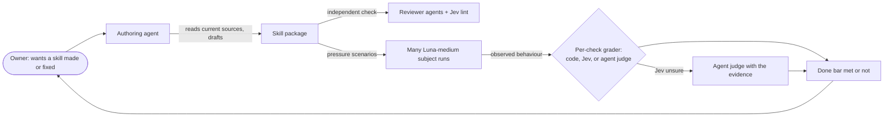

# Skill authoring plugin: Requirements

Owner: Shravan. Requirements author: the skills-evals Lead session. Status: **confirmed by the owner 2026-10-04** (question tool, after the restart). The Specification and Program Design live beside this file once written; this file holds who the plugin is for, what they need, and the boundary of the work. It holds no obligations (`MUST` statements); those belong to the Specification.

Decision trail: the owner's decisions (2026-10-02, 2026-10-04 and 2026-10-06) are recorded in the private coordination thread for this design. The evidence report behind rows U13–U33 is kept privately; its decisive anchors were re-verified.

## Why this exists

Skill authoring lives inside `shravan-dev-workflow` today. `skills-creation` and `skill-audit` name five other skills in that plugin and load two of its shared files by relative path. The plugin's general workflow skills hand skill-package work back to `skills-creation` by name in 20 files. The pressure evals that prove skill behaviour grade a subject's self-reported answer with literal regular expressions and one model judge. Recorded results show both ways mislead:

- a scenario counted as passed while one of its checks printed a failure;
- regexes failed answers that had *rejected* the bad rationalization they matched;
- a judge failed a chat-only answer for not producing artifacts the prompt never asked for;
- a single green run hid inconsistent reasoning.

The owner's view: none of the current evals is built well, and skill authoring is a big enough part of how work gets done to be its own product.

The diagram shows the job, not a design: who acts and what each needs to see. No current UI changes (`no current UI`).

## Affected people and agents

| Class | Who | Job | Pain today |
|---|---|---|---|
| C1 Owner | Shravan | gets skills made, fixed, and trusted; decides tradeoffs | eval results can't be trusted, so he can't tell whether a skill change helped |
| C2 Authoring agent | the Lead session doing skill work in any repo | creates, edits, reviews, ships a skill | follows stale names; treats proposed changes as shipped; skills-creation ties it to one plugin |
| C3 Subject runner | Luna-medium agents running pressure scenarios | behave naturally under a scenario prompt | sees inputs that can leak the grading criteria |
| C4 Grader | code checks, Jev, an agent judge | decide one narrow check each | judges guess outside the prompt's scope; regexes read words, not behaviour |
| C5 Other repos' skill authors | anyone with skills outside ai-tools (for example agent-studio's `.codex/skills`) | author and test their own skills | the current tooling assumes this repo's plugins |
| S1 Workflow plugin users | sessions using `shravan-dev-workflow` | hand skill-package work to the right place | today that handoff names a skill in another place by plugin |

## Owner-decided needs

Authority: `authorized` means an explicit owner decision recorded on the thread above. Priority `must` was set by those decisions; no row has a lower owner priority.

| ID | Class | Need, in the owner's terms | Authority | Priority |
|---|---|---|---|---|
| U1 | C1, C2 | Skill authoring is its own plugin, `skill-authoring`, taking skills-creation, pressure testing, the skill-change spec, and skill-audit out of `shravan-dev-workflow`. | authorized 10-02 | must |
| U2 | C1, S1 | Standalone both ways: neither plugin names the other; the owner combines them by invoking skills together. `shravan-dev-workflow` does not care whether a target is a skill; skill specs live in skill-authoring. | authorized 10-02, clarified 10-06 | must |
| U3 | C5 | It serves any repo's skills, not only this repo's plugins. | authorized 10-02 | must |
| U4 | C1, C2 | Five skills: an orchestration skill; skill creation; skill review (multiple reviewer agents plus Jev lint checks); pressure testing and evals; skill audit. They are carved out of today's `skills-creation` and `skill-audit` files, not written from scratch. The skill spec is written by skill creation, which already holds its format; the orchestration skill carries it across runs. | authorized 10-02, clarified 10-06 | must |
| U5 | C1 | Evals are cheaper and more reliable. | authorized 10-02 | must |
| U6 | C4 | A scenario is graded by a checklist of narrow questions; each question is answered by code, a Jev yes/no, or an agent judge depending on how the check is classified and framed. No regex gates. | authorized 10-02 | must |
| U7 | C3 | Subjects run on Luna medium and fan out easily to many parallel runs: "if Luna can run them, anybody can". | authorized 10-02 | must |
| U8 | C4 | When Jev is certain, its answer stands; when it is not, the evidence goes to an agent judge in the eval. | authorized 10-04 | must |
| U9 | C1, C2 | Two done bars. A new skill from owner intent is done when its checks pass and Luna runs on realistic prompts show the behaviour. A fix for a recorded failure first makes that failure show up in a test, then passes several fresh runs. | authorized 10-04 | must |
| U10 | C2 | The plugin itself supplies three practices: read the current files before claiming anything; keep a record of what was decided and of proposed versus shipped; get an independent second-agent check. Every other general practice is "ask the user" or optional. | authorized 10-04 | must |
| U11 | C1, C5 | The pressure-testing method belongs to skill-authoring, and the runner is portable: any repo can pressure-test its own skills, with scenarios living beside those skills. | authorized 10-02, portability 10-04 | must |
| U12 | C1, S1 | Old names stop working at once; no compatibility shims (owner's standing hard-cutover rule). | authorized (standing rule) | must |
| U34 | C1, C2, C5 | The eval runner is its own package: local use now, published as a real package later. | authorized 10-06 | must |
| U35 | C1, C2, C5 | Run tools only with `pnpm dlx`; no skill installs an executable. | authorized 10-06 | must |

## Needs found in the evidence

The owner directed that the design rest on "what we truly need", found from recorded evidence. The owner confirmed this document on 2026-10-04, so these rows are `authorized`. Strength follows the evidence report: **strong** means repeated failures, verified closures, or measured comparisons.

| ID | Area | Need | What went wrong without it | Strength |
|---|---|---|---|---|
| U13 | orchestration | Carry decisions and state across runs; keep proposed, implemented, and reviewed apart. | a later run treated proposed behaviour as shipped | strong |
| U14 | orchestration | Ground every claim in current sources. | agents followed retired names and patched stale PRs | strong |
| U15 | orchestration | Keep "allowed to write it" apart from "proven to work". | invented failure-reproduction demands blocked intent-first drafts | medium |
| U16 | creation | Triggers that route correctly before the skill body loads. | near-miss prompts reached the wrong skill | strong |
| U17 | creation | The main path visibly routes to the depth, and the depth teaches how to do the work. | a reference existed but was unreachable, or held only field lists | strong |
| U18 | creation | One home per shared rule, with its users updated together. | copies disagreed; behaviour depended on the last copy read | strong |
| U19 | creation | Effort proportional to the job. | universal ceremony replaced the actual technique | strong |
| U20 | review | Independent inspection, with each candidate finding checked at its anchor. | a reviewer claimed something missing without opening the file that had it | strong |
| U21 | review | Review teaching, triggers, rule agreement, placement, and claim strength as separate properties. | a well-formed schema passed while teaching nothing | strong |
| U22 | review | Jev signals for narrow questions (duplicated rules, a rule losing its home, trigger overlap), with applicability filtered in code. | reviewers found these by hand; prompt-only filters over-flagged | strong |
| U23 | evals | Grade what the subject did, not what it says it did. | a subject named the rule without applying it, and the eval accepted it | strong |
| U24 | evals | Judge against the visible prompt and approved scope only. | judges demanded artifacts a chat-only prompt never asked for | strong |
| U25 | evals | Hide grading criteria; keep subject inputs organic. | a leaked fixture contaminated a run | strong |
| U26 | evals | Retrieve each check's evidence from the whole run, not a local window. | presence checks false-flagged; a bigger reasoning model didn't fix it | strong |
| U27 | evals | A later pass never erases an earlier failure. | a scenario showed green while a check had printed fail | strong |
| U28 | evals | Keep "the run broke" apart from "inconclusive" and "the skill failed". | permission stops were reported as skill failures | strong |
| U29 | evals | Controls and repeated fresh runs before claiming an improvement. | single green runs reasoned inconsistently | strong |
| U30 | evals | Run the subject once and reuse its observation across graders. | repeated subject runs multiply cost | medium |
| U31 | audit | Route each signal to update, create, merge, or skip by recurrence and evidence. | mention-only skills were rewritten as if broken | medium |
| U32 | audit | Put each fix at its true owner: prose, a code check, or the tool. | runner defects became more instructions | strong |
| U33 | audit | Keep lessons sourced and dated; a hypothesis is not a defect. | old notes lost provenance | medium |

Recorded as having **no evidence** of benefit (not proven useless, and not carried forward by default): the literal call grammar; the exact nine-check review list; two review stages on every edit; the convergence formula; the mandatory humanizer pass; board and trace machinery as part of skill work; audit label rules.

## Goal boundary

- **Goal:** a standalone `skill-authoring` plugin that helps an authoring agent in any repo create, review, test, and audit skills, with evals that are cheap enough to run often and reliable enough to trust.
- **Foundation to reuse:** the skill craft in `skills-creation` that the evidence supports (U16–U19); its review properties (U21); the repository's pressure-test runner as the starting point, made portable (U11); existing scenarios as input material, not as trusted tests.
- **Actually missing:** the standalone plugin; the orchestration skill; the multi-agent skill-review skill with Jev lint; the eval framework with per-check graders and the Jev cascade; the two done bars.
- **May change (ai-tools):** a new `plugins/skill-authoring/`; removal of skills-creation and skill-audit from `shravan-dev-workflow`, whose skill-package checks and mentions of those skills are deleted; the runner's grading, its portability to other repos, and the scenario format; repository docs, manifests, marketplace entries, changelog.
- **Protected:** the behaviour of every other `shravan-dev-workflow` skill beyond deleting its skill-package check; four of those files belong to the maintainer of work breakdown and skill review, and the Specification decides how they change with that maintainer; the owner's own settings and skill index; Router and board; agent-studio.
- **Non-goals:** regression tracking (later); building the Jev tool (another agent; skill-authoring consumes its interface); the orchestration engine and Inspector; retired skills.
- **Acceptable complexity (confirmed 10-04):** five skills, the eval framework, and its grader cascade. A run database, dashboards, cross-run governance, unattended automation, or automatic skill edits need renewed approval.
- **Acceptable evidence (confirmed 10-04):**
  - the five skills load with `shravan-dev-workflow` **not** installed, in Claude and Codex;
  - a code check finds no remaining old names;
  - the plugin's own skills meet the U9 done bars;
  - on a labelled set, per-check grading agrees with adjudicated truth, with the escalation rate and cost per scenario reported.

## Resolved owner questions

1. **Any repo versus a repo-local runner (U3, U11):** resolved 2026-10-04: the runner is portable, so other repos run pressure tests on their own skills.
2. **Acceptable complexity and acceptable evidence:** confirmed as written on 2026-10-04.
