# Shravan Dev Workflow

Codex-first workflow skills for moving from shared understanding to spec, plan,
implementation, review, handoff, debugging, docs, and operations work.

The plugin is built around one idea: each workflow phase should have a clear
owner, a clear artifact boundary, and a clear next handoff. Broad counsel still
exists through `quorum-counsel`, but day-to-day work should use the narrower
phase skills here.

## Mental Model

```text
shared understanding
        |
        v
      spec ----------------> plan ----------------> implementation
 design/review/handoff       create/review/handoff  execute/review/handoff
        |                         |                         |
        '----------- evidence, decisions, and boundaries ---'
```

`handoff` means portability. It does not mean the phase is approved, complete,
or ready for the next phase. A handoff packet makes context transferable so a
future agent, another CLI, or another machine can continue without guessing.

## Namespace Map

```text
Namespace            Concern                      Skills
-------------------  ---------------------------  ----------------------------
discuss-*            shared understanding          discuss-with-me
orchestrator-*       long-horizon coordination     orchestrator-goal
spec-*               design/spec boundary          spec-design-swarm
                                                  spec-review-swarm
                                                  spec-handoff
plan-*               implementation-plan boundary  plan-create
                                                  plan-review-swarm
                                                  plan-handoff
implementation-*     code/change boundary          implementation-execute-plan
                                                  implementation-review-swarm
                                                  implementation-handoff
ops-*                external operational systems  ops-security-review
                                                  ops-linear-tracking
debug-*              root-cause investigation      debug-investigation
docs-*               durable documentation         docs-maintain
skill-*              skill system maintenance      skill-audit
tui-*                structured chat presentation  tui-presentation
```

## Workflow Flow

```mermaid
flowchart LR
    discuss["discuss-with-me\nshared understanding"]
    goal["orchestrator-goal\ncoordination contract"]

    specDesign["spec-design-swarm\ndesign formation"]
    specReview["spec-review-swarm\nadversarial review"]
    specHandoff["spec-handoff\nportable spec context"]

    planCreate["plan-create\nimplementation plan"]
    planReview["plan-review-swarm\nadversarial review"]
    planHandoff["plan-handoff\nportable plan context"]

    implExecute["implementation-execute-plan\nexecute written plan"]
    implReview["implementation-review-swarm\nreview code/diff/PR"]
    implHandoff["implementation-handoff\nportable code state"]

    discuss --> specDesign
    discuss --> planCreate
    goal --> specDesign
    goal --> planCreate
    goal --> implExecute

    specDesign --> specReview
    specReview --> specHandoff
    specReview --> planCreate
    specHandoff --> planCreate

    planCreate --> planReview
    planReview --> planHandoff
    planReview --> implExecute
    planHandoff --> implExecute

    implExecute --> implReview
    implReview --> implHandoff
```



## Core Phase Skills

### Shared understanding

Use `discuss-with-me` when the work is still a conversation: reflecting back,
stress-testing a decision, naming tradeoffs, or clarifying whether the next
artifact should be a spec, plan, implementation, or docs update.

Use `orchestrator-goal` when the objective is long-running and already clear
enough to become a verifiable Codex or Claude `/goal` contract. If the goal is
fuzzy, it routes back to `discuss-with-me`.

### Spec boundary

Use `spec-design-swarm` to shape a design, architecture, or product direction
before an implementation plan exists. It can use bounded explorer, security,
architecture, and adversarial lanes, but the parent agent owns the synthesis.

Use `spec-review-swarm` to attack a drafted spec/design before planning. It
keeps accepted, contested, and open findings separate instead of forcing fake
consensus.

Use `spec-handoff` to package spec/design context for a future session. It
preserves decisions, non-goals, contracts, tradeoffs, evidence, security
context, and open questions without creating an implementation plan.

### Plan boundary

Use `plan-create` to turn spec/design context into a written implementation
plan. It stays read-only against product code and captures task sequence, write
surfaces, validation gates, rollback or recovery notes, risks, and open
questions.

Use `plan-review-swarm` to review a written implementation plan before code
changes. It checks the whole artifact, verifies claims against the repo, and can
revise the plan for accepted issues without implementing code.

Use `plan-handoff` to package an existing implementation plan for another agent,
CLI, machine, or future session. If no plan exists yet, use `spec-handoff` or
`plan-create` instead.

### Implementation boundary

Use `implementation-execute-plan` to validate and execute a written plan. It may
coordinate bounded subagent slices, but the parent owns integration,
verification, and completion claims.

Use `implementation-review-swarm` to review code, diffs, commits, PRs, or named
files. Codex reviewer lanes are the default; Claude or Gemini/`agy` lanes are
explicit opt-in external counsel. Reviewer outputs are candidates, not truth,
and accepted findings are verified before edits.

Use `implementation-handoff` when real implementation state exists: branch,
diff, changed files, commits, validation output, failed commands, blockers, or
risk. It is for continuation, audit, or manual review of work already in motion.

## Supporting Skills

- `debug-investigation`: diagnosis-first debugging before fixes. Use it for
  failing tests, flaky behavior, crashes, regressions, build failures, or
  unexpected behavior.
- `docs-maintain`: durable documentation maintenance after source-of-truth drift
  is identified. It keeps README human-facing, `agents.md` compact, and workflow
  history in changelog/runbook docs.
- `ops-security-review`: routes explicit authorized security scans to the
  official Codex Security plugin workflows.
- `ops-linear-tracking`: manages Linear projects, milestones, issues, and
  dependencies while keeping docs as the design source of truth.
- `skill-audit`: audits current skills, session evidence, and upstream
  inspirations before recommending updates or new skills.
- `tui-presentation`: gives agents a shared structure for readable chat/TUI
  explanations, diagrams, comparisons, and multi-section responses.

## External Counsel

This workflow does not use broad multi-model counsel by default.

```text
normal review path
  implementation-review-swarm / plan-review-swarm / spec-review-swarm
      -> Codex reviewer lanes by default
      -> Claude or Gemini/agy only when explicitly requested

manual counsel path
  quorum-counsel
      -> still available, but not the default workflow
```

Oracle is excluded from `shravan-dev-workflow` review swarms.

## How To Use

Examples:

```text
Use discuss-with-me to talk through this design decision before editing files.
Use spec-design-swarm to shape this feature before writing a plan.
Use spec-review-swarm to attack this architecture spec before planning.
Use spec-handoff to package this design for another agent without creating a plan.
Use plan-create to turn this spec into an implementation plan.
Use plan-review-swarm to validate this plan against the repo before coding.
Use implementation-execute-plan to validate and execute this written plan.
Use implementation-review-swarm to review this diff and include Claude counsel.
Use implementation-handoff to package this branch for another agent to continue.
Use docs-maintain to reconcile this README and agents.md with current plugin state.
```

## References

- Skill source: [`skills/`](skills/)
- Trigger and routing evals: [`references/trigger-evals.md`](references/trigger-evals.md)
- Source inspirations: [`references/source-inspirations.md`](references/source-inspirations.md)
- Release notes: [`../../docs/changelog/`](../../docs/changelog/)
- Maintainer guidance: [`../../agents.md`](../../agents.md)
