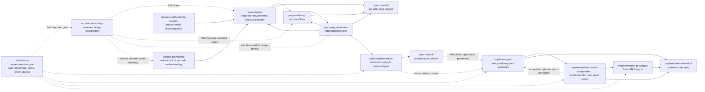

# Shravan Dev Workflow

Shravan's development workflow skills for moving from shared understanding to spec, plan, implementation, review, handoff, debugging, docs, and operations work.

The plugin is built around one idea: each workflow phase should have a clear owner, a clear artifact boundary, and a clear next handoff. Day-to-day work should use the narrower phase skills here.

## Mental Model

```text
shared understanding
  -> orchestrator-implementation-goal: implementation planning, execution/proof, review, and delivery
       -> orchestrator-design: coordinate and verify the design cycle
       -> spec-design: separate Requirements and Specification
       -> program-design: structural How
       -> spec-program-review: proportional independent three-artifact design review
       -> stop at reviewed three-artifact design or explicit gap; never enter planning automatically
  -> plan-implementation: one canonical plan + proof mapping
  -> implement-plan: approved immutable plan + implementation proof
  -> implementation-review: ordered checks in one independent 🔎 Review Sidekick session + rails reduction
       -> stop before corrections and PR work
```

`handoff` means portability. It does not mean the phase is approved, complete, or ready for the next phase. A handoff packet makes context transferable so a future agent, another CLI, or another machine can continue without guessing.

Design-bearing planning is admitted only from a `three-artifact-design` mode `spec-program-review` result that is `ready` and semantically current for the Requirements, Specification, and Program Design. A handoff preserves that evidence; it does not create it. The only direct planning bypass is work positively classified as implementation-mechanics-only with no new design-bearing decision.

## Namespace Map

```text
Namespace            Concern                      Skills
-------------------  ---------------------------  ----------------------------
discuss-*            shared understanding          discuss-clarify-mental-models
                                                  discuss-pathfinding
research-*           evidence gathering            research-workflow
manage-*             subordinate agents            manage-agents
orchestrator-*       bounded workflow routing      orchestrator-implementation-goal
                                                  orchestrator-design
spec-*               design/spec boundary          spec-design
                                                  program-design
                                                  spec-program-review
                                                  spec-handoff
plan-*               planning and portability     plan-implementation
                                                  plan-handoff
                                                  plan-improve-repo
implement-*          approved-plan execution      implement-plan
implementation-*     implementation judgment and lifecycle  implementation-review
                                                  implementation-pr-wrapup
                                                  implementation-handoff
ops-*                external operational systems  ops-security-review
                                                  ops-linear-tracking
debug-*              root-cause investigation      debug-investigation
docs-*               durable documentation         docs-maintain
skill-*              skill authoring/maintenance   skills-creation
                                                  skill-audit
presentation-*       surface-matched presentation  presentation-tui
                                                  presentation-webui
```

## Workflow Flow


```mermaid
flowchart LR
    pathfinding["discuss-pathfinding<br/>extract tacit or unmade understanding"]
    mentalModels["discuss-clarify-mental-models<br/>mental model reconvergence"]
    deliveryGoal["orchestrator-implementation-goal<br/>plan, implement, prove, review, deliver"]
    designCycle["orchestrator-design<br/>reviewed design coordination"]

    specDesign["spec-design<br/>separate Requirements and Specification"]
    programDesign["program-design<br/>structural How"]
    specReview["spec-program-review<br/>independent review"]
    specHandoff["spec-handoff<br/>portable spec context"]

    planImplementation["plan-implementation<br/>reviewed design to canonical plan"]
    planHandoff["plan-handoff<br/>portable plan context"]

    implementPlan["implement-plan<br/>ready delivery-plan execution"]
    implementationReview["implementation-review<br/>independent implementation and proof review"]
    implWrap["implementation-pr-wrapup<br/>finish PR lifecycle"]
    implHandoff["implementation-handoff<br/>portable code state"]

    pathfinding --> specDesign
    mentalModels --> specDesign
    deliveryGoal -.->|"first unproven gate"| designCycle
    deliveryGoal -.-> planImplementation
    deliveryGoal -.-> implementPlan
    deliveryGoal -.-> implementationReview
    deliveryGoal -.-> implWrap
    designCycle -.->|"first phase"| specDesign
    designCycle -.->|"follows phase-selected routes"| programDesign
    designCycle -.->|"one three-artifact design review"| specReview
    designCycle -.->|"only for unmade owner meaning"| pathfinding

    specDesign --> programDesign
    programDesign --> specReview
    specDesign --> specHandoff
    programDesign --> specHandoff
    specReview --> specHandoff
    specReview --> specDesign
    specReview --> programDesign
    specReview --> planImplementation
    planImplementation --> planHandoff
    planImplementation -.->|"ready delivery context"| implementPlan
    planHandoff -.->|"when exact approval is preserved"| implementPlan
    implementPlan --> implementationReview
    implementationReview -.->|"accepted implementation correction"| implementPlan
    implementationReview --> implWrap
    implementPlan --> implHandoff
    implementationReview --> implHandoff
    implWrap --> implHandoff
```

## Core Phase Skills

### Shared understanding

Use `discuss-clarify-mental-models` when the shared picture is unstable before artifact work: terms, boundaries, assumptions, source-of-truth questions, or tradeoffs need to be made inspectable. It stays read-only, checks bounded evidence, maps branches, names the countercase, and routes only after the model is confirmed or explicitly open. It is not the old one-forcing-question grill.

`discuss-pathfinding`: Extract unwritten understanding from the user — user and stakeholder requirements, tacit process knowledge, domain terms, design decisions — via batched grilling with attached reads, live challenge, and records as they crystallize. User-requirements extraction separates evidence from row-level authority, preserves direct users and non-operating stakeholders, forces priority ownership, and captures user-job sequence inputs for later specification views.

Codex display titles use the `Category: Action` form (for example, `Discuss: Pathfinding` and `Spec: Design`). Skill IDs remain kebab-case for invocation. Cursor can load these plugin directories through its explicit `agent --plugin-dir <path>` path; this repository does not provide a separate Cursor marketplace.

Use `research-workflow` when the next step is to gather evidence: local code/docs, sibling repos, DeepWiki-style repository research, current web/docs, Reader sources, memory, or session logs. It frames bounded research questions, walks source classes in order, labels claim quality, and writes tmp research ledgers for substantial runs. Substantial runs use source-class coverage, primary anchors, and a verified research ledger.

Use `manage-agents` when subordinate AI-agent mechanics are the work: spawning, calling, resuming, steering, queueing, monitoring, or reducing advisors, sidekicks, workers, operators, subagents, and swarms. The user-facing main remains the default conversation and author of governing design and implementation plans. After a ready plan, the persistent implementation Sidekick executes its assignment and associated proof directly by default; the user may explicitly choose direct contact with that assigned Sidekick without transferring authority or execution ownership. Material design/plan or integration questions return to Main with evidence, while Main does not relay every internal progress turn. The Sidekick delegates only bounded independent work, needed expertise, or large disposable output whose benefit exceeds coordination cost; standalone prescribed procedures use Operators. PR wrap-up may stay with the assigned implementation Sidekick or run as a prescribed Operator procedure; Main retains acceptance and the user retains merge authority. The skill also owns the agent-role to board-seat mapping, while Router owns seat semantics and enforcement. Its core skill owns pattern, model, and native-versus-ACPX routing; `acpx.md` owns provider-resolved agent calls and relationships; `acpx-provider-*` references own exact model ids and provider controls; persistent sessions are ledgered before follow-ups; and child output remains candidate evidence until verified.

Use `orchestrator-design` when the user asks to run or resume the full design cycle as one bounded workflow. The user-facing main loads `spec-design` and `program-design` and authors all governing artifacts, views, visual briefs, diagrams, and settled sections; helpers may gather evidence or execute a fixed rendering procedure, and an explicitly requested Advisor may advise. The workflow verifies meaningful visual coverage independently for each substantial Requirements, Specification, and Program Design artifact, preserves separate Requirements and Specification identities, follows compact handoffs through optional owner pathfinding and one three-artifact design review, then stops before planning. It permits one recorded recovery review when prior evidence is unavailable, without restoring a used correction round.

Use `orchestrator-implementation-goal` to carry implementation goals through main-authored planning, planned-PR implementation and proof, main assessment, independent review, accepted corrections, and the requested delivery boundary. Design stays with its own workflow when missing or contradicted. The default terminal is PR-ready and unmerged; merge requires explicit authority. Both orchestrators use `practices-show-me-your-work` for meaningful decision and evidence history, while checking current sources rather than replaying stored status. Direct one-phase requests bypass orchestration.

Use `practices-collaboration` at the start of a qualifying task to find the repository's board project and work thread, and whenever agents coordinate: seats, messages versus posts, waiting on another agent, and resolution. With no board project it asks the owner once and returns `no-home` so work continues.

Use `practices-show-me-your-work` at the start of a qualifying task to open or resume the work trace, while recording decisions, evidence, and outcomes, at every stop, or when the user asks to see the work. The trace lives in the work thread, or in a `docs/wip/work-trails/<date-label>/` folder marked unshared until a board exists, which Main then transfers. A qualifying task spans sessions, commissions another agent, crosses components, or makes a decision someone will later inspect; routine small edits get no trace unless one is requested.

### Spec boundary

Use `spec-design` to preserve two separate upstream concepts before program design or planning. Requirements owns WHY, for whom, and within what authorized boundary. Specification owns WHAT must be observably true and traces its normative obligations to Requirements. Each newly authored or substantively revised substantial document receives its own meaningful visual treatment at the correct altitude. A changed screen is an Image Gen picture grounded in the current app. Ownership, calls, state, flow, failure, and trust are Mermaid. Normative meaning remains in prose and tables. For substantial file-backed work, the skill reuses or creates a separately identifiable Requirements home and creates a different Specification home; it never substitutes one combined `Requirements/spec` artifact. It keeps unresolved owner meaning visible and leaves internal component structure downstream.

Use `program-design` to define structural How against the settled specification: current-system constraints, alternatives and crux, component trees, singular ownership, interfaces, state, source-anchored call paths and flows, failure/recovery, concurrency/consistency, trust boundaries, compatibility/cutover, and proof seams. A generated explanatory overview may aid the reader only after main-authored semantic composition and inspection; exact structural views and prose remain authoritative. It turns stack/trace evidence into implementable entrypoint-to-effect views and produces an executable mental model, not a task list.

Use `spec-program-review` to classify and independently review a Specification, Program Design, or complete Requirements, Specification, and Program Design set. A different-lineage 🔎 Review Sidekick reads the whole artifact set, reconstructs the smallest model satisfying the confirmed goal, and walks mode-complete, sequential seam passes when large, proof-challenge for executable claims, dispel, and focused checks for named residual risks. Prescribed proof commands go to a 🔧 Operator under an exact grant. The lead returns a coverage-bound verdict without editing or accepting the design; semantically unaffected corrections may retain verified coverage. Why/What findings route to `spec-design`; structural How findings route to `program-design`.

The old `orchestrator-goal`, `plan-creation-swarm`, `plan-review-swarm`, `implementation-execute-plan`, and `implementation-review-swarm` source trees are preserved under [`retired-skills/`](retired-skills/) for provenance and are not runtime entrypoints. The active `orchestrator-implementation-goal`, `plan-implementation`, `implement-plan`, and `implementation-review` are new minimal implementations, not aliases or revivals of those retired trees; they do not restore swarms, controller briefs, worker protocols, transition ledgers, or a separate plan-review layer.

Use `spec-handoff` to package spec/design context for a future session. It preserves decisions, non-goals, contracts, tradeoffs, evidence, security context, open questions, current artifact paths, the the current three-artifact design review result (mode, covered targets, result, and coverage statement) or a pointer to it, and semantic review freshness without creating an implementation plan. It routes missing How to `program-design`, complete but unreviewed or semantically stale three-artifact designs to `spec-program-review`, and current ready three-artifact designs to `plan-implementation`.

### Plan boundary

Use `plan-implementation` when the user-facing main translates one semantically current ready Requirements, Specification, and Program Design set into one repo-grounded canonical Markdown plan. Helpers may gather bounded repository/proof evidence, but the main authors every slice, dependency, proof row, and PR boundary. It stops before tickets, implementation, review, Git, or PR work.

Use `plan-improve-repo` to audit a repo for high-leverage improvements without editing source. Delegated audit work returns evidence and candidates; the main admits findings and authors any canonical plan. It retains direct authority over admitted repository-improvement findings, including source-proven implementation-mechanics-only work, without taking reviewed-design planning away from `plan-implementation`. Direct work on one named runtime skill package routes through `skills-creation`.

Use `plan-handoff` to package an existing implementation plan for another agent, CLI, machine, or future session. It preserves the exact canonical plan record, governing planning basis, delivery context, and current main's authorship. Only a named successor-main recipient, transferred planning scope, and explicit user direction transfer plan authorship. If no plan exists yet, use `spec-handoff` for portability or `plan-implementation` to create one from current ready design; never present design context as an existing plan.

### Implementation boundary

Use `implement-plan` to validate and execute one immutable-path canonical `draft` plan only after separate later owner approval names that exact path and current meaning. It re-anchors before edits, works inline by default, advances through the smallest ready proof-bearing slice, preserves proof gates, and stops with an exact semantic route when current reality breaks the plan or design. It stops before independent review and PR work.

Use `implementation-review` for independent product implementation and proof review after execution. It admits exact governing authority, ready plan, source, diff, and proof identities. A different-lineage 🔎 Review Sidekick reads the whole map and walks spec-compliance, sequential overlapping chunk passes, proof challenge, dispel, and predicate-selected focused checks. It verifies candidates against the rails and routes corrections by semantic cause without editing. Runtime skill-package review remains under `skills-creation`.

Use `implementation-pr-wrapup` to finish the GitHub PR lifecycle after implementation, typically after independent review on a delivery goal: push/open/update the PR, write a why-and-shape description, monitor checks and comments, process existing review threads, prove mergeability with current GitHub state, and merge only when user authorization exists. Fresh code-review discovery routes to `implementation-review`; PR wrap-up does not substitute for it. Independent-review coverage is not a wrap-up ready gate.

Use `implementation-handoff` when real implementation state exists: branch, diff, changed files, commits, validation output, failed commands, blockers, or risk. It is for continuation, audit, or manual review of work already in motion.

## Supporting Skills

- `debug-investigation`: diagnosis-first debugging before fixes. Use it for failing tests, flaky behavior, crashes, regressions, build failures, or unexpected behavior. For long-running infra or batch monitoring, it loads a background-monitoring reference for redacted JSONL/state watchers that are cheap, cancellable, and visible through the agent harness when available.
- `docs-maintain`: durable documentation maintenance after source-of-truth drift is identified. It keeps README human-facing, `AGENTS.md` compact, and workflow history in changelog/runbook docs.
- `ops-security-review`: routes explicit authorized security scans to the official Codex Security plugin workflows.
- `ops-linear-tracking`: manages Linear projects, milestones, issues, and dependencies while keeping docs as the design source of truth.
- `skills-creation`: creates, updates, or evaluates one named skill or accepted draft, or executes one run or slice of an accepted multi-run skill-change spec. The main authors the proposal/spec/plan; an implementation Sidekick may execute an accepted run, produce fitting proof, and return it for main assessment before different-lineage implementation review.
- `skill-audit`: audits current skill portfolios, session evidence, and upstream inspirations before recommending create/update/merge/skip decisions.
- `presentation-tui`: hybrid TUI + markdown presentation for monospace terminal/CLI surfaces — box-drawing skeleton with markdown atoms (inline code, fences, GFM tables by default for comparisons). Shares markdown baseline, diagram semantics, and Mermaid judgment with `presentation-webui` via `shared-references/`.
- `presentation-webui`: markdown-first presentation for rendered proportional-font chat surfaces — headings/lists/GFM tables as the skeleton, smallest-view media selection (pseudocode, call trees, file trees, diffs, Mermaid, fenced box layouts), and the same shared baseline and diagram judgment.

## External Counsel

Review workflows do not use broad multi-model counsel by default. The persistent Review Sidekick lead, its ordered checks, and its model, runtime, history isolation, and authority are resolved through `manage-agents`.

```text
normal review path
  spec-program-review
      -> bounded independent specification/program review
  implementation-review
      -> one complete independent implementation/proof review
```

## How To Use

Examples:

```text
Use discuss-clarify-mental-models to reconverge before writing a spec or plan.
Use discuss-pathfinding to grill me on tacit requirements or unmade decisions.
Use spec-design to preserve separate Requirements and Specification identities: authorized Why and observable What.
Use program-design to turn this specification into structural How.
Use spec-program-review to independently review these Requirements, Specification, and Program Design artifacts.
Use spec-handoff to package this design for another agent without creating a plan.
Use orchestrator-implementation-goal to carry this goal through planning, implementation, proof, review, and PR readiness.
Use plan-implementation to create one repo-grounded proof-bearing plan from this reviewed design set.
Use implement-plan to execute this ready canonical plan at its immutable path, current meaning, and `pr-ready-unmerged` delivery context, then return fresh implementation proof without starting review or PR work.
Use implementation-review to independently review this implementation and proof without editing or starting PR lifecycle work.
Use research-workflow to gather source-grounded evidence into a tmp ledger.
Use plan-improve-repo to audit this repo and write immutable canonical plan-only improvement plans. When delivery is requested later, route the admitted finding through plan-implementation to establish current delivery intent instead of upgrading the prior plan.
Use implementation-pr-wrapup to handle existing PR comments and prove merge readiness.
Use implementation-handoff to package this branch for another agent to continue.
Use docs-maintain to reconcile this README and AGENTS.md with current plugin state.
```

## Source And Maintainer Resources

- Skill source: [`skills/`](skills/)
- Shared runtime references: [`shared-references/`](shared-references/)
- Design-view vocabulary and ownership index: [`docs/diagram-vocabulary.md`](docs/diagram-vocabulary.md)
- Source inspiration catalog: [`docs/source-inspiration-catalog.md`](docs/source-inspiration-catalog.md)
- Release smoke and behavioral checks: [`../../docs/changelog/references/shravan-dev-workflow-smoke.md`](../../docs/changelog/references/shravan-dev-workflow-smoke.md)
- Release notes: [`../../docs/changelog/`](../../docs/changelog/)
- Maintainer guidance: [`../../AGENTS.md`](../../AGENTS.md)
