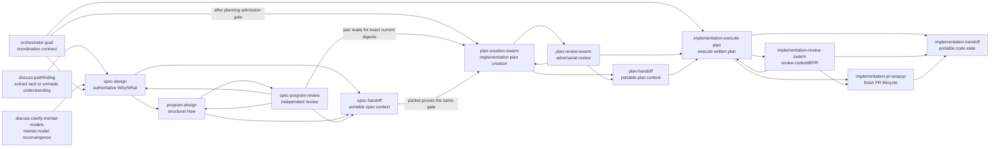

# Shravan Dev Workflow

Shravan's development workflow skills for moving from shared understanding to spec, plan, implementation, review, handoff, debugging, docs, and operations work.

The plugin is built around one idea: each workflow phase should have a clear owner, a clear artifact boundary, and a clear next handoff. Day-to-day work should use the narrower phase skills here.

## Mental Model

```text
shared understanding
  -> spec-design: authoritative Why/What
  -> program-design: structural How
  -> spec-program-review: exact-digest independent pair review
  -> plan + proof matrix
  -> implementation proof
```

`handoff` means portability. It does not mean the phase is approved, complete, or ready for the next phase. A handoff packet makes context transferable so a future agent, another CLI, or another machine can continue without guessing.

Design-bearing planning is admitted only from a current pair-mode `spec-program-review` result that is `ready` for the exact current specification and program-design digests. A handoff preserves that evidence; it does not create it. The only direct planning bypass is work positively classified as implementation-mechanics-only with no new design-bearing decision.

## Namespace Map

```text
Namespace            Concern                      Skills
-------------------  ---------------------------  ----------------------------
discuss-*            shared understanding          discuss-clarify-mental-models
                                                  discuss-pathfinding
research-*           evidence gathering            research-swarm
manage-*             subordinate agents            manage-agents
orchestrator-*       long-horizon coordination     orchestrator-goal
spec-*               design/spec boundary          spec-design
                                                  program-design
                                                  spec-program-review
                                                  spec-handoff
plan-*               implementation-plan boundary  plan-creation-swarm
                                                  plan-improve-repo
                                                  plan-review-swarm
                                                  plan-handoff
implementation-*     code/change boundary          implementation-execute-plan
                                                  implementation-review-swarm
                                                  implementation-pr-wrapup
                                                  implementation-handoff
ops-*                external operational systems  ops-security-review
                                                  ops-linear-tracking
debug-*              root-cause investigation      debug-investigation
docs-*               durable documentation         docs-maintain
skill-*              skill authoring/maintenance   skills-creation
                                                  skill-audit
tui-*                structured chat presentation  tui-presentation
```

## Workflow Flow


```mermaid
flowchart LR
    pathfinding["discuss-pathfinding<br/>extract tacit or unmade understanding"]
    mentalModels["discuss-clarify-mental-models<br/>mental model reconvergence"]
    goal["orchestrator-goal<br/>coordination contract"]

    specDesign["spec-design<br/>authoritative Why/What"]
    programDesign["program-design<br/>structural How"]
    specReview["spec-program-review<br/>independent review"]
    specHandoff["spec-handoff<br/>portable spec context"]

    planCreate["plan-creation-swarm<br/>implementation plan creation"]
    planReview["plan-review-swarm<br/>adversarial review"]
    planHandoff["plan-handoff<br/>portable plan context"]

    implExecute["implementation-execute-plan<br/>execute written plan"]
    implReview["implementation-review-swarm<br/>review code/diff/PR"]
    implWrap["implementation-pr-wrapup<br/>finish PR lifecycle"]
    implHandoff["implementation-handoff<br/>portable code state"]

    pathfinding --> specDesign
    mentalModels --> specDesign
    goal --> specDesign
    goal -->|"after planning admission gate"| planCreate
    goal --> implExecute

    specDesign --> programDesign
    programDesign --> specReview
    specDesign --> specHandoff
    programDesign --> specHandoff
    specReview --> specHandoff
    specReview --> specDesign
    specReview --> programDesign
    specReview -->|"pair ready for exact current digests"| planCreate
    specHandoff -->|"packet proves the same gate"| planCreate

    planCreate --> planReview
    planCreate --> planHandoff
    planReview --> planCreate
    planReview --> planHandoff
    planReview --> implExecute
    planHandoff --> implExecute

    implExecute --> implReview
    implExecute --> implWrap
    implReview --> implExecute
    implReview --> implWrap
    implExecute --> implHandoff
    implReview --> implHandoff
    implWrap --> implHandoff
```

## Core Phase Skills

### Shared understanding

Use `discuss-clarify-mental-models` when the shared picture is unstable before artifact work: terms, boundaries, assumptions, source-of-truth questions, or tradeoffs need to be made inspectable. It stays read-only, checks bounded evidence, maps branches, names the countercase, and routes only after the model is confirmed or explicitly open. It is not the old one-forcing-question grill.

`discuss-pathfinding`: Extract unwritten understanding from the user — requirements, tacit process knowledge, domain terms, design decisions — via batched grilling with attached reads, live challenge, and decision/process/glossary records as they crystallize.

Use `research-swarm` when the next step is to gather evidence: local code/docs, sibling repos, DeepWiki-style repository research, current web/docs, Reader sources, memory, or session logs. It frames bounded research questions, routes source-specific lanes, labels claim quality, and writes tmp research ledgers for substantial runs. Substantial swarm lanes use explicit packet contracts with source anchors, security context, candidate-evidence labels, and completion receipts; parent ledgers reduce lane evidence before anything becomes accepted truth.

Use `manage-agents` when subordinate AI-agent mechanics are the work: spawning, calling, resuming, steering, queueing, monitoring, or reducing advisors, sidekicks, delegates, operators, subagents, and swarms. Its core skill owns pattern, model, and native-versus-ACPX routing; `acpx.md` owns provider-resolved agent calls and relationships; `acpx-provider-*` references own exact model ids and provider controls; persistent sessions are ledgered before follow-ups; and child output remains candidate evidence until verified.

Use `orchestrator-goal` when the objective is long-running and already clear enough to become a verifiable Codex or Claude `/goal` contract. Never-articulated intent or unmade decisions route to `discuss-pathfinding`; an existing shared model that has drifted routes to `discuss-clarify-mental-models`. For substantial goals, the contract carries a requirements/proof matrix and parent-owned completion gate; child agents, reviewers, UI drivers, and observability queries produce evidence, not completion by themselves. At closeout, `orchestrator-goal` accounts for lifecycle gates with the simple statuses `done`, `not-applicable`, `open`, and `blocked`; `done` requires an evidence pointer and does not imply rerunning already-completed review cycles.

### Spec boundary

Use `spec-design` to define authoritative Why/What before program design or planning: consumer and problem, current observable reality, outcomes, non-goals, requirements, public or externally observable contracts, constraints, failure obligations, and proof modalities. It keeps unresolved product meaning visible and leaves internal component structure downstream.

Use `program-design` to define structural How against the settled specification: current-system constraints, alternatives and crux, component trees, singular ownership, interfaces, state, calls and flows, failure/recovery, concurrency/consistency, trust boundaries, compatibility/cutover, and proof seams. It produces an executable mental model, not a task list.

Use `spec-program-review` to independently classify and review a specification, a program design, or their pair. It binds exact digests, reconstructs the model, dispatches one fresh mode-complete reviewer plus predicate-selected focused lanes, and returns a coverage-bound verdict without editing artifacts or accepting the pair. Why/What findings route to `spec-design`; structural-How findings route to `program-design`.

The superseded `spec-creation-swarm` and `spec-review-swarm` source trees are preserved under [`retired-skills/`](retired-skills/) for provenance. They are not runtime skills; creation and review route through the three skills above.

Use `spec-handoff` to package spec/design context for a future session. It preserves decisions, non-goals, contracts, tradeoffs, evidence, security context, open questions, exact artifact digests, and pair-review freshness without creating an implementation plan. It routes missing How to `program-design`, complete but unreviewed or stale pairs to `spec-program-review`, and design-bearing work to `plan-creation-swarm` only when the packet proves the current exact-digest pair-ready gate.

### Plan boundary

Use `plan-creation-swarm` to turn an admitted source into a written implementation plan. Design-bearing work requires a current pair-mode `spec-program-review` result that is `ready` for the exact current specification and program-design digests; missing How routes to `program-design`, and a complete but unreviewed or stale pair routes to `spec-program-review`. A direct bypass is allowed only when source inspection positively proves that no new product obligation, owner/boundary, interface, state semantic, failure/recovery policy, concurrency/consistency decision, compatibility realization, trust control, or proof seam is required. The skill stays read-only against product code and captures task sequence, dependency graph, parallel work lanes, write surfaces, validation gates, rollback or recovery notes, risks, and open questions. Non-trivial plans include a requirements/proof matrix with source requirements, owning tasks, proof modalities, evidence sources, freshness guards, and proof layers; if proof cannot pass at the planned scope, the plan should split or replan before execution.

Use `plan-improve-repo` to audit a repo for high-leverage improvements without editing source. It may vet findings and maintain a backlog before planning admission, but writes or marks an executable plan `ready` only from a current exact-digest pair-ready result or a positively proven implementation-mechanics-only classification. Direct work on one named runtime skill package routes through `skills-creation`. It supports quick, deep, focus, branch, next, validate-plan, and reconcile flows.

Use `plan-review-swarm` to review a written implementation plan before code changes. It checks the whole artifact and verifies claims against the repo. Accepted blocker/important findings route back to `plan-creation-swarm`; missing Why/What routes to `spec-design`, and missing structural How routes to `program-design`.

Use `plan-handoff` to package an existing implementation plan for another agent, CLI, machine, or future session. If no plan exists yet, use `spec-handoff` or `plan-creation-swarm` instead.

### Implementation boundary

Use `implementation-execute-plan` to validate and execute a written plan. It may coordinate bounded subagent slices and uses them whenever work is parallelizable into disjoint lanes, but the parent owns integration, verification, implementation proof, and completion claims. Worker packets cite exact plan tasks, requirement/proof rows, allowed write scopes, proof obligations, and completion receipts so subagent output can be reduced against the plan.

Use `implementation-review-swarm` to review code, diffs, commits, PRs, or named files. Codex reviewer lanes are the default; Claude or Gemini/`agy` lanes are explicit opt-in external counsel. Reviewer outputs are candidates, not truth, and accepted findings are verified before edits. Implementation review verifies that proof maps back to requirements/spec/plan before a ready verdict. Reviewer packets include source-of-truth inputs, proof inventory, lane focus, and completion receipts so lanes produce different evidence instead of generic summaries. Accepted blocker/important findings normally route back to `implementation-execute-plan`.

Use `implementation-pr-wrapup` to finish the GitHub PR lifecycle after implementation work exists: push/open/update the PR, monitor checks and comments, process existing review threads, prove merge readiness with fresh state, and merge only when user authorization exists. This is a low-thinking workflow by default because state reads and gates carry the rigor. Fresh code-review discovery still belongs to `implementation-review-swarm`.

Use `implementation-handoff` when real implementation state exists: branch, diff, changed files, commits, validation output, failed commands, blockers, or risk. It is for continuation, audit, or manual review of work already in motion.

## Supporting Skills

- `debug-investigation`: diagnosis-first debugging before fixes. Use it for failing tests, flaky behavior, crashes, regressions, build failures, or unexpected behavior. For long-running infra or batch monitoring, it loads a background-monitoring reference for redacted JSONL/state watchers that are cheap, cancellable, and visible through the agent harness when available.
- `docs-maintain`: durable documentation maintenance after source-of-truth drift is identified. It keeps README human-facing, `AGENTS.md` compact, and workflow history in changelog/runbook docs.
- `ops-security-review`: routes explicit authorized security scans to the official Codex Security plugin workflows.
- `ops-linear-tracking`: manages Linear projects, milestones, issues, and dependencies while keeping docs as the design source of truth.
- `skills-creation`: creates, updates, or evaluates one named skill or accepted draft with YAML trigger design, a `SKILL.md` mental model and main path, reference depth, steering language, pressure proof, platform validation, source-adaptation checks, and sensitive-resource routing.
- `skill-audit`: audits current skill portfolios, session evidence, and upstream inspirations before recommending create/update/merge/skip decisions.
- `tui-presentation`: gives agents a shared structure for readable chat/TUI explanations, diagrams, comparisons, and multi-section responses. It teaches disclosure sequence and visual-family selection while preserving semantic markdown for code, paths, URLs, and technical tokens.

## External Counsel

This workflow does not use broad multi-model counsel by default.

```text
normal review path
  implementation-review-swarm / plan-review-swarm / spec-program-review
      -> Codex reviewer lanes by default
      -> Claude or Gemini/agy only when explicitly requested
```

Oracle is excluded from `shravan-dev-workflow` review swarms.

## How To Use

Examples:

```text
Use discuss-clarify-mental-models to reconverge before writing a spec or plan.
Use discuss-pathfinding to grill me on tacit requirements or unmade decisions.
Use spec-design to define the authoritative Why and What.
Use program-design to turn this specification into structural How.
Use spec-program-review to independently review this specification/program-design pair.
Use spec-handoff to package this design for another agent without creating a plan.
Use research-swarm to gather source-grounded evidence into a tmp ledger.
Use plan-creation-swarm to turn this exact-digest pair-ready specification/program-design result into an implementation plan.
Use plan-improve-repo to audit this repo and write executable improvement plans.
Use plan-review-swarm to validate this plan against the repo before coding.
Use implementation-execute-plan to validate and execute this written plan.
Use implementation-review-swarm to review this diff and include Claude counsel.
Use implementation-pr-wrapup to handle existing PR comments and prove merge readiness.
Use implementation-handoff to package this branch for another agent to continue.
Use docs-maintain to reconcile this README and AGENTS.md with current plugin state.
```

## References

- Skill source: [`skills/`](skills/)
- Trigger and routing evals: [`references/trigger-evals.md`](references/trigger-evals.md)
- Source inspiration catalog: [`docs/source-inspiration-catalog.md`](docs/source-inspiration-catalog.md)
- Release smoke and behavioral checks: [`../../docs/changelog/references/shravan-dev-workflow-smoke.md`](../../docs/changelog/references/shravan-dev-workflow-smoke.md)
- Release notes: [`../../docs/changelog/`](../../docs/changelog/)
- Maintainer guidance: [`../../AGENTS.md`](../../AGENTS.md)
