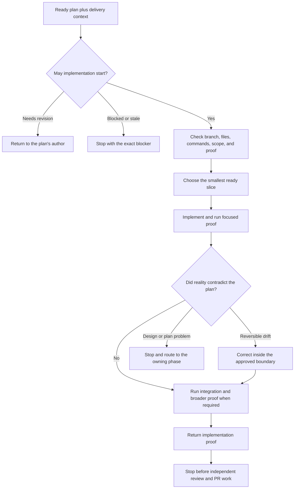

# Implement Plan

`implement-plan` executes one ready implementation plan whose delivery context authorizes implementation. It verifies the plan, governing basis, and delivery context against the current repository, completes the smallest safe slice, and returns fresh proof. It does not review its own work or manage the PR.

The runtime contract remains in [SKILL.md](./SKILL.md). Detailed execution and proof guidance lives in [execution-and-proof.md](./references/execution-and-proof.md).

## Workflow

## Important Branches

- A plan needing revision returns to its planner; a blocked plan stops at its named owner.
- Plan-only, missing, malformed, or stale governing basis/delivery context stops implementation.
- A design surprise is not patched around. It returns to design.
- A required proof gate is never weakened to make the run pass.
- Independent implementation review happens afterward in `review-implementation`.

## Output

Changed files plus fresh focused, integration, manual/runtime, and quality evidence as applicable. Progress and proof remain outside the plan itself.
