# Implementation Review

`implementation-review` independently checks implemented work and its proof. The parent agent acts as review coordinator: it reads the governing sources and the whole diff itself, composes a review DAG for the specific change — chunks with deliberate overlap, sequenced gates, predicate-selected lanes — dispatches fresh-context reviewer subagents, and verifies every candidate finding against the rails (requirements, specification, program design, goal boundary) before accepting anything.

The runtime contract remains in [SKILL.md](./SKILL.md). Chunking and DAG composition are in [coordination-and-chunking.md](./references/coordination-and-chunking.md), the review method is in [reviewing-implementation.md](./references/reviewing-implementation.md), and rails-anchored finding reduction is in [finding-and-reduction.md](./references/finding-and-reduction.md).

## Workflow

```mermaid
flowchart TD
    A[Implementation, proof, governing basis, ready plan, delivery context] --> B{Is the change meaningful?}
    B -- No --> C[Verify every changed file and affected consumer]
    C --> D[Return non-substantial with no reviewer dispatch]
    B -- Yes --> E{Are authority, plan, diff, and proof complete?}
    E -- No --> F[Return blocked input]
    E -- Yes --> G[Coordinator reads whole map: governing basis + complete diff]
    G --> H[Compose review DAG: chunk plan with overlap, lane predicates]
    H --> I[Spec-compliance gate]
    I --> J[Chunk reviewers in parallel]
    J --> K[Dispel lane challenges findings and over-delivery]
    H --> L[Proof-challenge lane executes claimed proof]
    K --> M[Reduce on the rails: re-anchor, deletion test, scope effect]
    L --> M
    M --> N{Review result}
    N -- Ready --> O[Route to PR readiness]
    N -- Needs revision --> P[Route each finding by its actual cause]
    N -- Decision needed --> Q[Stop for the owner]
    N -- Blocked --> F
```

## Important Branches

- Requirements or observable-behavior problems return to `spec-design`.
- Structural ownership, interfaces, state, failure, or trust problems return to `program-design`.
- Slice ordering or proof-map problems return to the originating planner.
- Code, test, fixture, or implementation-proof problems return to `implement-plan`.
- Findings that would expand scope, add unrequested subsystems, or weaken requirements return `decision-needed` to the owner instead of being accepted.
- Corrected work may receive another review only within the bounded delivery effort's three-remediation limit; after remediation three the workflow stops.

## Output

One result — ready, needs revision, blocked input, decision needed, or remediation limit reached — with rails-anchored verified findings, rejected findings with evidence, remaining uncertainty, and exact routes.
