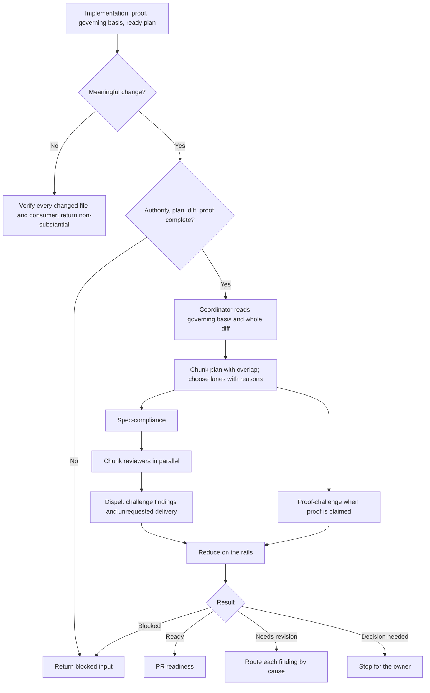

# Implementation Review

`implementation-review` independently checks implemented work and its proof. The parent agent coordinates: it reads the governing sources and the whole diff itself, chooses which reviewer lanes to run and in what order, hands each reviewer complete files plus the quoted rails with deliberate overlap, and verifies every candidate finding against those rails before accepting anything.

The runtime contract is [SKILL.md](./SKILL.md). Chunking and lane order are in [coordination-and-chunking.md](./references/coordination-and-chunking.md), the review method is in [reviewing-implementation.md](./references/reviewing-implementation.md), and rails-anchored reduction is in [finding-and-reduction.md](./references/finding-and-reduction.md).

## Workflow

## Important Branches

- Requirements or observable-behavior problems return to `spec-design`; structural problems to `program-design`; slice or proof-map problems to the originating planner; code and proof problems to `implement-plan`.
- A reviewer proposal that adds unrequested scope is rejected; an unrequested element already in the diff gets removal or an owner decision.
- Corrected work may be reviewed again only within the three-remediation limit.

## Output

One result — ready, needs revision, blocked input, decision needed, or remediation limit reached — with rails-anchored findings, rejected findings with evidence, remaining uncertainty, and exact routes.
