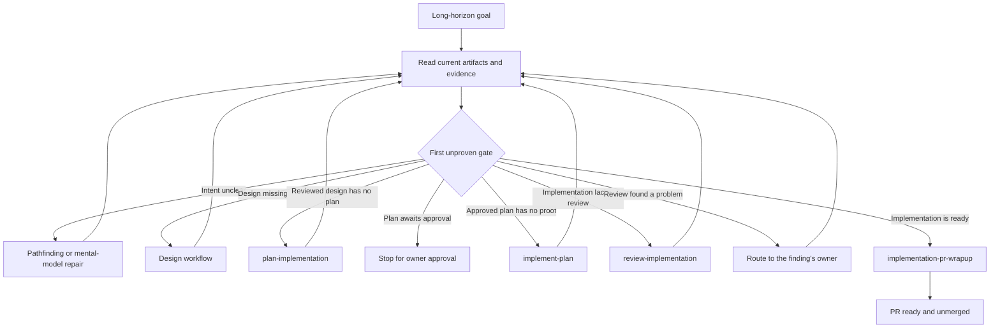

# Orchestrator Goal

`orchestrator-goal` moves a long-running change through existing workflow owners. It does not redo their work or maintain another progress system. On every turn it finds the first unproven gate, invokes exactly one owner, verifies that owner's result, and either continues or stops at a real decision.

The runtime contract remains in [SKILL.md](./SKILL.md). The compact routing model is in [goal-contract-and-routing.md](./references/goal-contract-and-routing.md).

## Workflow

## Important Branches

- A request for only one phase bypasses long-horizon routing and invokes that phase directly.
- A runtime-skill package needs an explicit `skills-creation` composition.
- Tickets are optional tracking projections and prove no delivery gate.
- Missing, stale, or conflicting evidence stops at the phase that owns it.
- Merge always requires separate authorization.

## Output

The current proven gate, the one owner invoked now, that owner's verified result, and whether the requested terminal has been reached. No controller files, transition logs, duplicated receipts, or document digests are created.
