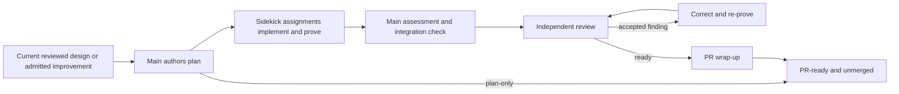

# Orchestrator: Implementation Goal

`orchestrator-implementation-goal` carries a delivery goal across main-authored planning, planned-PR implementation and proof, main assessment, independent review, accepted correction, and PR readiness. The user-facing main owns governing design and plans; persistent implementation Sidekicks receive bounded PR assignments.

The runtime contract is [SKILL.md](./SKILL.md). Current-source orientation, routing examples, recovery, and finish checks are in [goal-contract-and-routing.md](./references/goal-contract-and-routing.md).

Design repair remains a separate owner. If an incomplete prerequisite can be completed within the settled model, the implementation goal stays open and resumes afterward. A material design break returns to the user before more implementation is built on it.

The workflow uses `track-show-me-your-work` for consequential decisions and results. A shared thread follows the work across sessions; nested phase owners contribute checkpoints. Session endings do not automatically resolve the thread. The trail supports orientation but never replaces current source, proof, review, or PR evidence.

Normal implementation correction is capped at three remediation passes. One bounded recovery review is possible when prior evidence is unavailable and current source has been inspected, but recovery cannot reset known history or be repeated. Merge always requires explicit authority.
