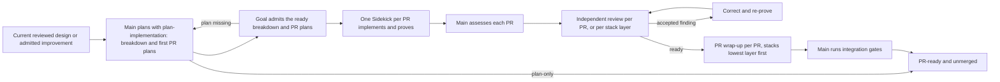

# Orchestrator: Implementation Goal

`orchestrator-implementation-goal` carries a delivery goal from a ready breakdown and PR plans through per-PR implementation and proof, main assessment, independent review per PR or stack, accepted correction, integration gates, and PR readiness. The user-facing main writes the breakdown and each PR plan with `plan-implementation` before this skill admits them; persistent implementation Sidekicks each receive one PR, and Main sequences a stack's layers.

The runtime contract is [SKILL.md](./SKILL.md). Current-source orientation, routing examples, the missing-history baseline, and finish checks are in [goal-contract-and-routing.md](./references/goal-contract-and-routing.md).

```mermaid
flowchart LR
    A[Current reviewed design or admitted improvement] --> P[Main plans with plan-implementation: breakdown and first PR plans]
    P -->|plan-only| G[Requested terminal]
    P --> B[Goal admits the ready breakdown and PR plans]
    B -->|plan missing| P
    B --> C[One Sidekick per PR implements and proves]
    C --> H[Main assesses each PR]
    H --> D[Independent review per PR, or per stack layer]
    D -->|accepted finding| E[Correct and re-prove]
    E --> D
    D -->|ready| F[PR wrap-up per PR, stacks lowest layer first]
    F --> I[Main runs integration gates]
    I --> G[PR-ready and unmerged]
```

Design repair remains a separate owner. If an incomplete prerequisite can be completed within the settled model, the implementation goal stays open and resumes afterward. A material design break returns to Main, which brings the owner a brief, before more implementation is built on it.

The workflow uses `practices-show-me-your-work` for consequential decisions and results. A shared thread follows the work across sessions; nested phase owners contribute checkpoints. Session endings do not automatically resolve the thread. The trail supports orientation but never replaces current source, proof, review, or PR evidence.

Implementation correction repeats while the review loop converges; when it stops converging, the owner gets a brief of what keeps failing. When prior review evidence is unavailable, the current review sets the baseline. Merge always requires explicit authority.
