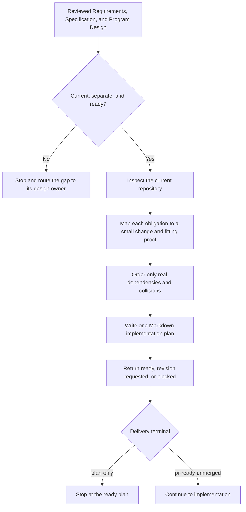

# Plan Implementation

`plan-implementation` lets the user-facing main turn reviewed design into one practical Markdown implementation plan. The main reads the Requirements, Specification, and Program Design, checks them against the current repository, and authors the small slices and matching proof. Helpers may gather bounded evidence; implementation Sidekicks receive the finished plan rather than write it.

The runtime contract remains in [SKILL.md](./SKILL.md). Detailed slicing guidance lives in [slice-and-proof-design.md](./references/slice-and-proof-design.md).

## Workflow

## Important Branches

- A runtime-skill package returns to `skills-creation` unless an accepted composition explicitly selected this planner.
- Missing or stale design returns to the design owner; planning does not repair design.
- Direct planning establishes `plan-only` versus `pr-ready-unmerged` at entry when intent is ambiguous. Goal orchestration supplies `pr-ready-unmerged` by default.
- A ready delivery plan continues to implementation without a generic post-plan approval stop; a `plan-only` plan stops at planning.
- Optional tickets may point to the plan, but they never become another plan.

## Output

One proportional Markdown plan that names the work, order, proof, integration points, and stop conditions. It contains no progress tracking, approval state, document digest, or PR state.
