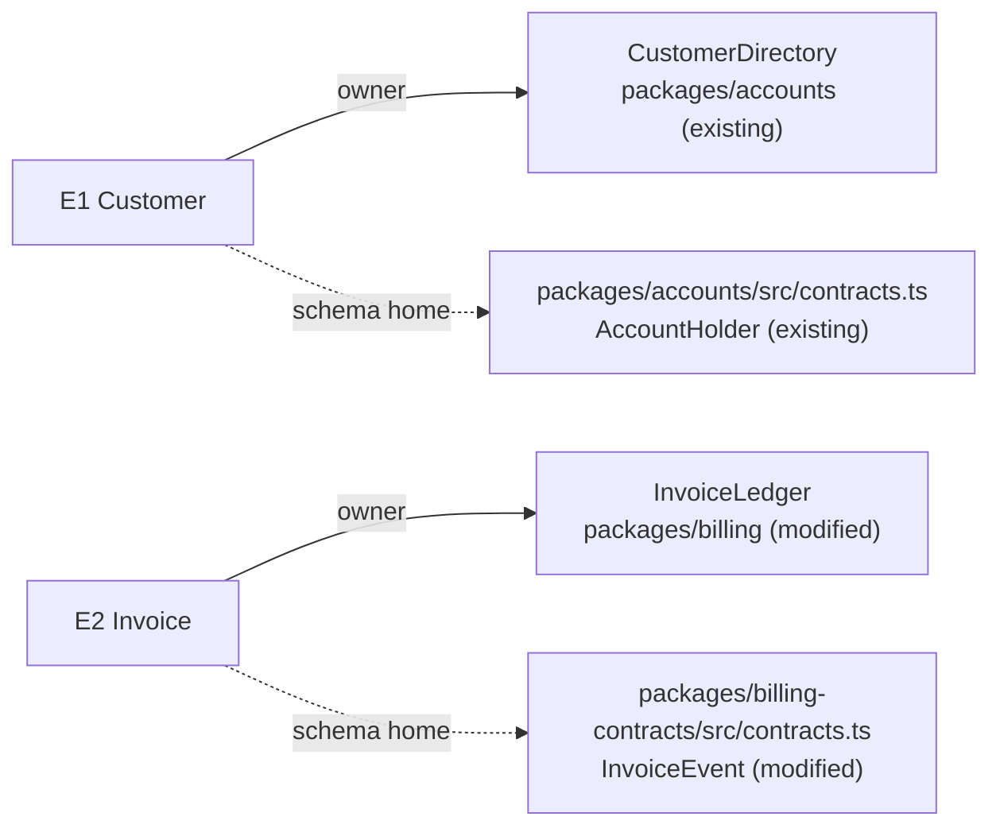

# Components, Ownership, and Interfaces

This reference owns entity binding, target composition, component depth, singular ownership, dependency direction, and behavioral interfaces.

Expected inputs: selected direction, requirements, the Specification's entity table (`E` identifiers with identity rules, relationships, invariants, and states), current-system model, constraints, and design crux.

Return in workflow order: first the entity binding table, its code shapes, the found type conventions or `none found`, and each design-only concept with the `E` or `R` it serves; then the integrated overview and component tree; after the caller assigns ownership/dependency direction and defines interfaces, return the component tree, ownership/dependency maps, interface contracts, forbidden edges, and gaps.

## Entity Binding

An entity the Specification defined has to live somewhere before components can be composed around it. For each `E`, binding gives three separate answers: which component is responsible for its truth and invariants (semantic owner), which package or module its code lives in (home), and which module declares its shape (schema/type home). It adds whether the entity is `persisted | derived | cached` and what shape it has at every boundary it crosses.

Semantic owner, home, and schema/type home are different altitudes. The owner is a component; the home is where that code lives; the schema/type home is the single module every consumer imports the shape from. Two components in one package is normal. One entity with two schema copies is a defect.

### Find the type conventions

Look for the repository's written type rules, then for the pattern its existing schemas follow:

- root and package `AGENTS.md` or `CLAUDE.md`;
- rule files such as `.cursor/rules/` and language-rule files;
- the existing schemas in the packages the design touches: when every contract there is a Zod discriminated union with a `z.infer` type, that is the convention even if no file states it.

Record each rule or pattern with its source. When nothing is written and the touched packages show no pattern, record `none found` and write shapes as field lists with nullability and discriminant.

### What to inspect

- the Specification's entity table: every `E`, its identity rule, relationships, invariants, and states; the binding never redefines any of them;
- existing types and schemas for the same nouns in the current system, and the import paths consumers already use;
- package boundaries and import rules (workspace layout, package exports, lint boundaries, dependency direction);
- every place an entity crosses a process, service, storage, or queue boundary.

### Bind against existing code

- An existing type that carries an entity under a different name is a binding. Put the code name in the home or shape cell, mark it `existing`, and keep the Specification's term in design prose. Declaring a second schema for the same facts, or renaming the entity after the code type, breaks the one-owner rule.
- An identity or cardinality mismatch with existing code, such as a key that omits the account the Specification's identity rule includes, is a structural choice. Name the options and their cost. Return `decision-needed` when resolving it exceeds the confirmed goal boundary.
- Only a noun the Specification never defined, or a meaning that conflicts with it, returns `specification-gap`.
- A design-only concept (a wait handle, an idempotency key, a cache entry) names the `E` or `R` it serves. A concept that serves none is deleted, not kept as scaffolding.

### Filled template

Disclose by depth: the map shows where each entity lives, the table gives every binding answer, and the code shape pins the contract. This example comes from a billing repository whose root `AGENTS.md` says Zod schemas own runtime types and variants are discriminated unions.



| E | Semantic owner | Package or module home | Schema/type home | Shape at each boundary | Disposition | Convention |
| --- | --- | --- | --- | --- | --- | --- |
| E1 Customer | `CustomerDirectory` | `packages/accounts` (existing; code name `AccountHolder`) | `packages/accounts/src/contracts.ts` (existing) | `customerId: string` on every billing event (existing) | persisted | Zod owns the type (root `AGENTS.md`) |
| E2 Invoice | `InvoiceLedger` | `packages/billing` (modified) | `packages/billing-contracts/src/contracts.ts` (modified) | `InvoiceEvent`, billing to notifications, below (new variants) | persisted | Zod discriminated union with `z.infer` (root `AGENTS.md`) |

```ts
export const invoiceEventSchema = z.discriminatedUnion("name", [
  z.object({
    name: z.literal("billing/invoice.settled"),
    data: z.object({
      invoiceId: z.string(),
      customerId: z.string(),
      settledAt: z.string().datetime(),
      amountMinor: z.number().int().nonnegative(),
    }),
  }),
  z.object({
    name: z.literal("billing/invoice.voided"),
    data: z.object({
      invoiceId: z.string(),
      customerId: z.string(),
      voidReason: z.enum(["duplicate", "customer-request", "fraud"]),
    }),
  }),
]);
export type InvoiceEvent = z.infer<typeof invoiceEventSchema>;
```

With `none found`, the same contract is a field list:

```text
billing/invoice.settled    discriminant: name
  invoiceId    string, required
  customerId   string, required
  settledAt    timestamp (ISO-8601), required
  amountMinor  integer >= 0, required
schema home: packages/billing-contracts (new variant)
```

Good: one schema home imported by every consumer; the owner named as a component and the home named separately; each boundary crossing showing its discriminant and nullable fields; an existing contract reused under its code name and marked `existing`; an open string the conventions forbid recorded with its closed replacement or a `gap: <why>`.

Bad: two copies of a payload schema in two packages; a package named as the semantic owner; a boundary shape described as "the event payload"; bullets where the table belongs; an entity redefined here with a different identity rule; a `new` contract where an `existing` one already carries the same facts; schema homes or payload fields deferred to planning.

Stop when every `E` has a row with every cell filled or marked `gap: <why>`, every boundary crossing has a shape in the found convention or a field list with nullability and discriminant, and every design-only concept names the `E` or `R` it serves.

## Integrated Overview

Build a walkable composition from the binding table:

```text
target system
  component A
    owns: truth / decision / invariant   (the E identifiers it owns)
    lives in: package or module (new | modified | existing)
    exposes: interface
    consumed by: callers
    changes when: one reason
  component B
    owns: truth / decision / invariant
    lives in: package or module (new | modified | existing)
    exposes: interface
    consumed by: callers
    changes when: one reason
```

Components are semantic owners, not directories, and each has one home. For UI work, show state-owning containers, pure views, derived state, and integration/effect boundaries.

Use a component tree when hierarchy/composition matters and a topology view when peer boundaries or dependency direction matter more than nesting. Label owners and consumers on the view; do not infer ownership from box position alone.

## Depth and Ownership

Apply the deletion test: if removing a component makes its complexity disappear rather than move to callers, it is probably pass-through. If callers must learn nearly all its policy, lifecycle, or failure rules, it is shallow.

For every truth, invariant, lifecycle, and side effect, name exactly one authoritative owner. Define allowed/forbidden edges and the detection or enforcement class.

## Behavioral Interfaces

Each load-bearing interface states:

```text
owner and consumers
inputs/preconditions
outputs/postconditions: a closed variant, with a discriminant and fields per variant
sync/async semantics
state and side effects
idempotency/order guarantees
errors/cancellation: a closed variant with a bounded reason set
version/compatibility
negative space
examples when ambiguous
```

Result and decision contracts are closed variants in the found conventions. A read distinguishes `found` from `not-found`; a conditional write distinguishes `updated`, `conflict`, and `not-found`; a policy decision names each outcome and a bounded reason set. Transport failures and invalid payloads are their own variants, never disguised as a business outcome.

```ts
type SettlementDecision =
  | { readonly kind: "settle"; readonly settledAt: string }
  | { readonly kind: "reject"; readonly reason: "amount-mismatch" | "already-settled" | "invoice-voided" };
```

Write one representative caller interaction before finalizing. Add a seam for real variation, trust/process boundary, lifecycle owner, proof boundary, external/fallible dependency, or multiple consumers—not for abstraction aesthetics.

Good: interface hides owner policy and makes caller assumptions explicit; every variant a caller must branch on is a named member of the union.

Bad: signatures without semantics, “shared ownership,” one interface per current file, open strings for a result or reason, or variants that exist only in prose.

Complete when: every entity is bound, every component earns its boundary and names its home, ownership is singular, dependency direction is enforceable, every result and decision contract is a closed variant, and caller behavior is predictable.
