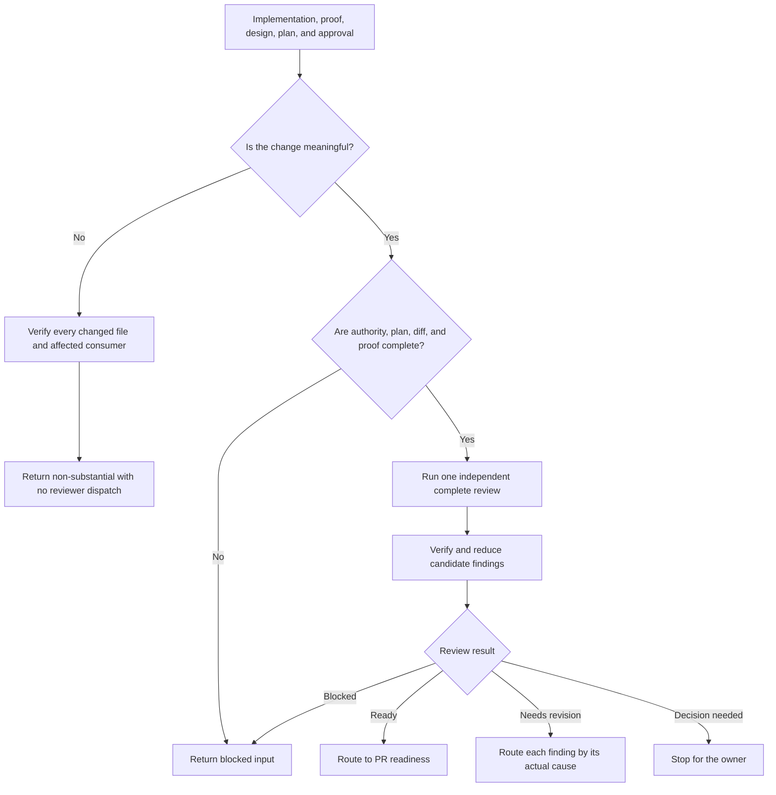

# Review Implementation

`review-implementation` independently checks implemented work and its proof. It reconstructs what should have changed from the governing design and plan, reads the actual diff and source, verifies candidate findings, and routes each accepted problem to the owner that can fix its cause.

The runtime contract remains in [SKILL.md](./SKILL.md). The review method is in [reviewing-implementation.md](./references/reviewing-implementation.md), and finding reduction is in [finding-and-reduction.md](./references/finding-and-reduction.md).

## Workflow

## Important Branches

- Requirements or observable-behavior problems return to `spec-design`.
- Structural ownership, interfaces, state, failure, or trust problems return to `program-design`.
- Slice ordering or proof-map problems return to the originating planner.
- Code, test, fixture, or implementation-proof problems return to `implement-plan`.
- Corrected work requires fresh affected review; old coverage is not reused.

## Output

One result—ready, needs revision, blocked, or decision needed—with verified findings, rejected findings, remaining uncertainty, and exact routes. The reviewer does not edit source or approve its own corrections.
